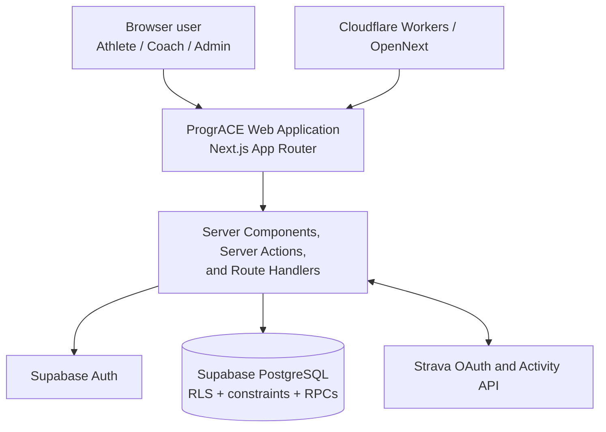
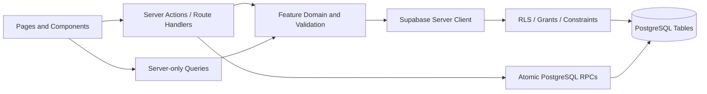
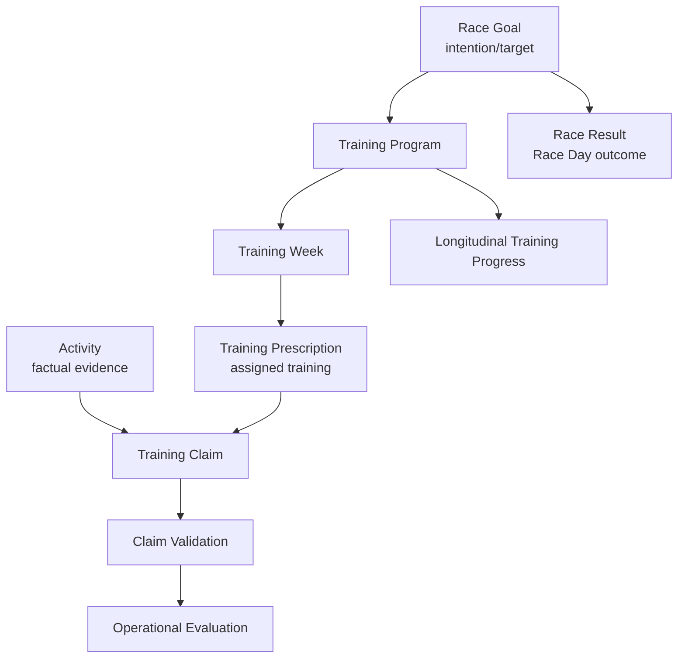

# Technical Architecture Overview

## Purpose

This document describes the implemented application structure at a level suitable for adaptation into a non-developer user manual. It deliberately excludes credentials, environment values, and production identifiers.

## System Context

## Frontend

- Next.js 15 App Router and React 19.
- TypeScript for application and domain types.
- Tailwind CSS for responsive presentation.
- Server Components are the default; client components are used for interaction such as forms, filters, dialogs, and responsive navigation.
- Zod validates form and domain inputs at the application boundary.
- No chart library is installed; the Running Progress visual implementation uses repository-native components.

The `AGENTS.md` development guidance also names shadcn/ui and React Hook Form, but they are not listed as direct dependencies in the audited `package.json`. Their active dependency status is therefore **REQUIRES MANUAL VERIFICATION** and they are not claimed as core runtime packages here.

## Backend/Application Layer

The same Next.js project supplies server-rendered pages and server-side operations:

- feature-scoped server queries load bounded authorized data;
- Server Actions validate forms, call Supabase, revalidate affected routes, and redirect with safe feedback;
- route handlers support authentication callbacks, XLSX download, and Strava OAuth;
- reusable domain modules perform calculations outside UI components;
- narrow PostgreSQL functions perform important atomic/security-sensitive mutations.

There is no separate custom REST microservice layer in the repository.

## Database

Supabase PostgreSQL stores application source-of-truth entities. Security and consistency use several layers:

1. foreign keys and unique/check constraints;
2. triggers that protect lifecycle and immutable audit fields;
3. Row Level Security for user-owned and authorized data;
4. column-level grants/revocations;
5. narrow `SECURITY DEFINER` functions when an atomic cross-table operation or protected server-side fact is necessary.

All schema evolution is recorded in forward migrations under `supabase/migrations/`.

## Authentication and Authorization

Supabase Auth supplies authenticated user identity and sessions. The application then resolves actual roles from `user_roles` and `roles`.

Authorization is record-specific:

- Athlete ownership uses the authenticated profile/user ID.
- Coach scope primarily uses `training_programs.created_by` for the relevant Program/Race Goal.
- Admin checks require the actual `ADMIN` role.
- Active Mode is stored presentation context and is never authoritative permission.

Forced-password-change enforcement is applied at the shared authenticated layout/session boundary. Admin password reset uses a server-only privileged Auth client and never exposes the service credential to the browser.

## External Services

### Strava

Strava is an evidence provider. OAuth is initiated and completed through server route handlers. Connection credentials are protected and never selected into ordinary user-facing query results. Imported Activities remain ProgrACE records and only affect a Program through a submitted Claim.

### Supabase

Supabase supplies authentication and hosted PostgreSQL/data APIs. It is core infrastructure rather than a user-facing training partner.

### Cloudflare

The application is configured to build through OpenNext for Cloudflare Workers, with static assets and observability bindings declared in `wrangler.jsonc`. Environment-specific values are managed outside source control. Actual production deployment status is **REQUIRES MANUAL VERIFICATION**.

## Application Layers

## Domain Separation

Race Goal target, Race Result outcome, Prescription assignment, and Activity evidence are not interchangeable.

## Build and Deployment Configuration

- Local/development: Next.js scripts in `package.json`.
- Production build: `next build` and OpenNext Cloudflare tooling.
- Worker entry: generated `.open-next/worker.js`.
- Compatibility mode includes Node.js compatibility for the configured Cloudflare date.
- No deployment was performed for this audit.

The generic scaffold text in `README.md` still references Vercel and does not reflect the current Cloudflare configuration; the repository configuration files are treated as authoritative.

## Repository Evidence

- `AGENTS.md`
- `package.json`
- `app/`
- `src/features/`
- `src/lib/supabase/`
- `supabase/migrations/`
- `wrangler.jsonc`
- `open-next.config.ts`
- `next.config.ts`
