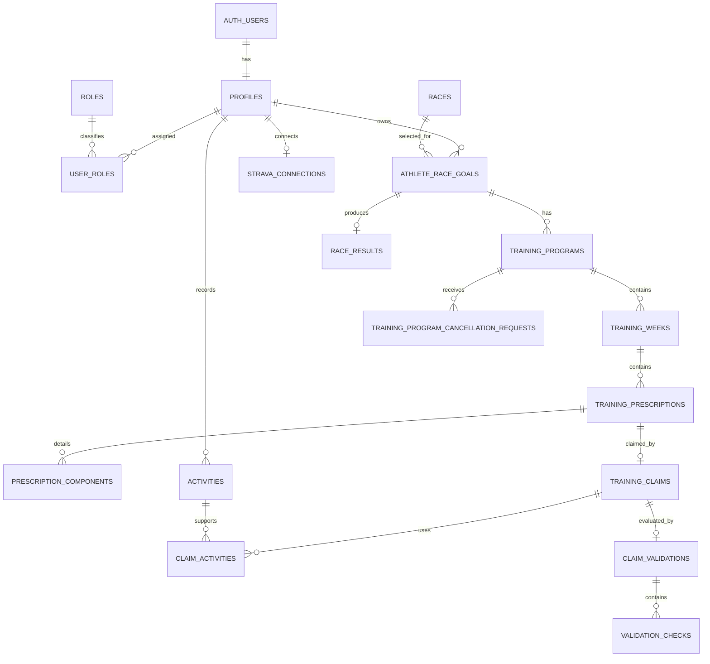

# Database Overview

This is a domain-oriented overview, not a database dump. It contains no row data, credentials, or production identifiers.

## Simplified Entity Relationship



`AUTH_USERS` is Supabase Auth's managed user source; application profile/role tables reference the same user identity.

## Identity and Authorization Entities

| Table/entity | Purpose | Important relationships and lifecycle |
|---|---|---|
| `profiles` | Application identity, display name/email projection, forced-password-change state | One profile per Auth user; referenced by ownership/audit fields. |
| `roles` | Defines actual role names | Current meaningful values are ATHLETE, COACH, ADMIN. |
| `user_roles` | Supports multiple roles per user | Authorization source used by RLS/RPC checks. |

## Race and Goal Entities

| Table/entity | Purpose | Important relationships and lifecycle |
|---|---|---|
| `races` | Shared Race edition/date/location/distance | Referenced by Athlete Race Goals; only Coach/Admin may create under current policy. |
| `athlete_race_goals` | Athlete target for one Race | Belongs to profile and Race; ACTIVE/COMPLETED/CANCELLED; target time remains separate from actual result. |
| `race_results` | Actual manually recorded Race Day outcome | Zero or one per Race Goal; FINISHED/DNF/DNS; retains original `recorded_by`; independent from goal completion. |

## Training Plan Entities

| Table/entity | Purpose | Important relationships and lifecycle |
|---|---|---|
| `training_programs` | Program for an Athlete Race Goal | DRAFT/PUBLISHED/CANCELLED/ARCHIVED; creator defines Coach ownership; holds `tracking_start_date` and cancellation audit. |
| `training_weeks` | Materialized planned week | Belongs to Program; DRAFT/PUBLISHED. A missing row represents UNPLANNED. |
| `training_prescriptions` | Assigned session on a scheduled date | Belongs to a week; menu is EASY/MEDIUM/LONG/SPEED/STRENGTH. |
| `prescription_components` | Ordered workout details | Distance, duration, repetitions, per-repetition distance, recovery, target pace, instruction; component order is unique/deterministic. |
| `training_import_previews` | Authorized temporary XLSX parse result | Owned by importer; linked to goal and, after confirmation, imported Program; supports expiry/idempotency. |

## Activity, Claim, and Validation Entities

| Table/entity | Purpose | Important relationships and lifecycle |
|---|---|---|
| `activities` | Factual exercise evidence from MANUAL or STRAVA source | Owned by Athlete; metrics may be null; does not affect a Program without a submitted Claim. |
| `training_claims` | Athlete assertion linking a Prescription to evidence | DRAFT/SUBMITTED; one per Prescription; submitted records are protected. |
| `claim_activities` | Many-to-many Claim-to-Activity evidence association | Enables multiple Activities for one session; uniqueness prevents duplicate evidence association. |
| `claim_validations` | Existing automatic/reviewed result for a submitted Claim | One per Claim; results VERIFIED/PARTIAL/NEEDS_REVIEW/REJECTED. |
| `validation_checks` | Ordered factual checks supporting a Validation | Stores target/actual/context result details; not a separate user-created score. |

Training Evaluation and Training Progress are derived through bounded queries/domain logic; no separate persistent evaluation-score table was found.

## Strava Entities

| Table/entity | Purpose | Important relationships and lifecycle |
|---|---|---|
| `strava_access_permissions` | Admin-controlled eligibility to connect | Absence/false means denied; separate from actual connection. |
| `strava_connections` | One Athlete's OAuth connection and synchronization state | Sensitive credential material is protected from ordinary reads; disconnect does not delete Activities. |
| `strava_oauth_states` | Short-lived single-use OAuth state | Protects callback binding to the authenticated Athlete. |

## Cancellation Entity

| Table/entity | Purpose | Important relationships and lifecycle |
|---|---|---|
| `training_program_cancellation_requests` | Athlete request and Coach/Admin decision audit | Belongs to Program; PENDING/APPROVED/DECLINED; at most one PENDING request per Program; reviewed request provenance is immutable. |

Program cancellation itself is recorded on `training_programs` with `cancelled_at`, `cancelled_by`, and `cancellation_reason`. A CANCELLED Program must have complete audit data; a non-cancelled Program must not.

## Major Database Invariants

- One active Race Goal per Athlete is enforced by the existing Race Goal domain.
- Training Week and Prescription dates must remain inside Program/Race boundaries.
- Week planning status is DRAFT or PUBLISHED; UNPLANNED is represented by no row.
- Empty DRAFT weeks cannot be published through the planner.
- Claims can target only an Athlete's currently actionable published Prescription.
- Submitted Claim evidence is immutable and is the only Activity evidence used by Program analytics.
- Race Result is unique per Race Goal; FINISHED requires a positive time, DNF/DNS require no time, and creation before Race Date is rejected.
- CANCELLED Training Programs and other terminal histories cannot return to editable states.
- At most one cancellation request may be PENDING for a Program.

## Evaluation Window

Expected training behavior uses:

```text
tracking_start_date <= prescription scheduled date
and, when cancelled,
prescription scheduled date < cancellation effective date
```

This prevents false negative evaluation before mid-program adoption and after cancellation. It does not delete submitted historical evidence.

## Repository Evidence

- `src/types/database.ts`
- `supabase/migrations/20260914130353_initial_core_schema.sql`
- `supabase/migrations/20260914140000_secure_application_foundation.sql`
- `supabase/migrations/20260915100000_implement_training_prescription_foundation.sql`
- `supabase/migrations/20260915110000_implement_manual_activity_evidence.sql`
- `supabase/migrations/20260915120000_implement_training_claims.sql`
- `supabase/migrations/20260915130000_implement_training_validation.sql`
- `supabase/migrations/20260917100000_implement_strava_oauth_connection.sql`
- `supabase/migrations/20260922120000_admin_strava_access.sql`
- `supabase/migrations/20260923110000_weekly_training_planning_foundation.sql`
- `supabase/migrations/20260923140000_race_result_foundation.sql`
- `supabase/migrations/20260923160000_mid_program_adoption.sql`
- `supabase/migrations/20260924100000_training_program_cancellation_foundation.sql`
