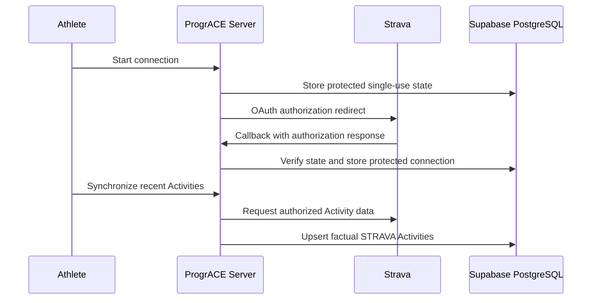

# Integration and Infrastructure Overview

## Strava — User-Facing External Integration

### Purpose

Strava supplies factual Activity evidence that an Athlete may later associate with a Training Prescription through a Claim. Strava does not own ProgrACE planning, validation, evaluation, Training Progress, or Race Result semantics.

### User-Facing Functions

- Admin allows or revokes Strava connection permission for an Athlete account.
- Permitted Athlete connects/reconnects using OAuth.
- Connected Athlete synchronizes recent Activities, subject to concurrency/hourly controls.
- Athlete sees connection and last-sync status and may disconnect.
- Athlete may add ProgrACE RPE/notes context to imported Activities.

### General Data Flow

### Authentication and Security Boundary

- OAuth state is bound to the authenticated Athlete and expires/is consumed once.
- Admin permission and connection status are separate facts; permission alone does not mean connected.
- Provider credentials are protected at rest and never returned by ordinary application queries or shown in the UI.
- Refresh and sync locks reduce concurrent token/synchronization races.
- Disconnect retains already imported Activities and downstream training history.
- No Activity is automatically claimed, validated, or converted into a Race Result.

Live Strava application approval, redirect URI, and production scopes are **REQUIRES MANUAL VERIFICATION**. No credential values are documented here.

## Supabase — Application Infrastructure

### Purpose

Supabase provides Auth, PostgreSQL, RLS-aware data APIs, and database functions used by the application.

### Data and Security Boundary

- User identity originates from Supabase Auth.
- Application profiles and actual roles are stored in PostgreSQL.
- Browser/server requests use session-aware clients; data visibility is constrained by RLS and grants.
- Atomic domain operations use narrowly scoped database functions that independently verify authenticated identity, role, ownership, and lifecycle.
- A privileged Auth client is restricted to server-only Admin password assistance; its credential is never part of client payloads.

Environment configuration names/values are intentionally omitted from this copyright package.

## Cloudflare and OpenNext — Deployment Infrastructure

### Purpose

OpenNext packages the Next.js application for Cloudflare Workers. Cloudflare serves the generated Worker and static assets; observability is enabled in the checked-in configuration.

### Security Boundary

- Environment-specific runtime values are managed outside source control.
- `wrangler.jsonc` declares bindings and compatibility behavior without embedding provider secrets.
- This audit confirms repository configuration, not current production deployment health.

Actual production project/account identity and deployment status are **REQUIRES MANUAL VERIFICATION**.

## XLSX — File Interchange, Not an External Service

ProgrACE supports a versioned Excel workbook format for complete Training Program import. The server parses the uploaded file with size, uncompressed-envelope, row, template, date, and domain checks. Import confirmation is an authenticated atomic database operation. No cloud spreadsheet provider integration was found.

## Integration Boundaries Summary

| System | Classification | Data entering ProgrACE | Explicit exclusions |
|---|---|---|---|
| Strava | User-facing external integration | Activity identity, sport/time/distance/duration and available factual metrics | No plan ownership, automatic Claim, automatic Race Result, laps/streams analytics |
| Supabase | Core infrastructure | Authenticated identity and persisted domain records | No user-manual claim of a separate training service |
| Cloudflare/OpenNext | Hosting/runtime infrastructure | HTTP requests and generated application assets | No training-domain data transformation |
| XLSX workbook | User file import | Training weeks, Prescriptions, and components after preview/confirmation | No live Microsoft/Google spreadsheet integration |

## Repository Evidence

- `app/api/strava/connect/route.ts`
- `app/api/strava/callback/route.ts`
- `app/dashboard/integrations/strava/page.tsx`
- `src/features/strava/`
- `src/features/training-import/`
- `src/lib/supabase/`
- `supabase/migrations/20260917100000_implement_strava_oauth_connection.sql`
- `supabase/migrations/20260917130000_implement_strava_activity_sync.sql`
- `supabase/migrations/20260922120000_admin_strava_access.sql`
- `package.json`
- `wrangler.jsonc`
- `open-next.config.ts`
