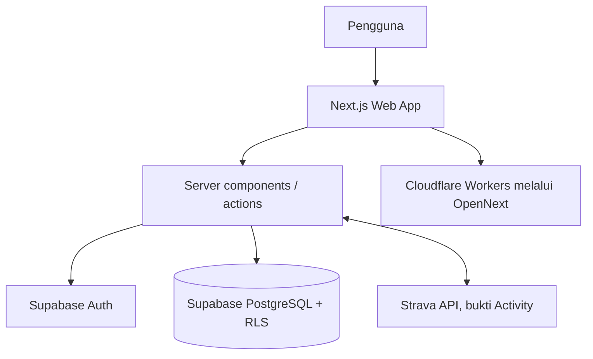
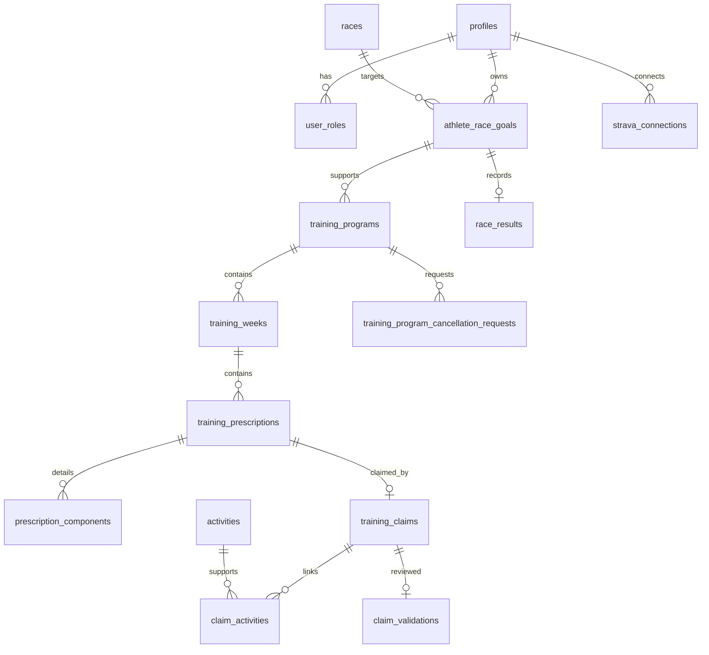

# BUKU PANDUAN PENGGUNAAN PROGRACE

## ProgrACE Versi 1.0 — Baseline Dokumentasi Hak Cipta

**Status dokumen:** Naskah sumber manual pengguna (untuk peninjauan pemilik)

| Informasi | Nilai |
|---|---|
| Nama aplikasi | ProgrACE |
| Versi dokumentasi | 1.0 |
| Baseline perangkat lunak | `v1.0.0-copyright` |
| Pemegang hak cipta | Jay Idoan Sihotang |
| Institusi | Fakultas Teknologi Informasi, Universitas Advent Indonesia |
| Tahun | 2026 |
| Situs resmi | https://progr-ace.idoans.app |

Informasi registrasi, nomor pencatatan, tempat/tanggal publikasi pertama, dan
metadata hukum lain yang belum tersedia harus dilengkapi oleh pemilik hak cipta.

> **Catatan penggunaan naskah.** Istilah tombol dan label berbahasa Inggris
> dipertahankan sebagaimana tampil di aplikasi. Gambar yang dirujuk masih berupa
> placeholder dan harus diisi dengan tangkapan layar data demonstrasi yang telah
> disanitasi.

## Daftar Isi (struktur)

1. Pendahuluan
2. Mengenal ProgrACE
3. Mengakses ProgrACE
4. Panduan Athlete
5. Panduan Coach
6. Panduan Admin
7. Siklus Training Program
8. Pemecahan Masalah
9. Penutup
10. Lampiran

---

# Bab 1 — Pendahuluan

## 1.1 Tujuan buku

Buku ini menjelaskan penggunaan ProgrACE Versi 1.0 berdasarkan perilaku yang
terverifikasi di repository aplikasi. ProgrACE membantu Athlete dan Coach
menyusun latihan lari, mencatat bukti aktivitas, menghubungkan bukti dengan
latihan, melakukan validasi, dan meninjau perkembangan training.

Manual ini menjelaskan tindakan yang tersedia bagi setiap peran. Detail teknis
seperti Row Level Security (RLS) dijelaskan secara ringkas pada Bab 8 dan tidak
dimaksudkan sebagai petunjuk administrasi database.

## 1.2 Sasaran pembaca

- **Athlete**, yang mengikuti Race Goal, melihat jadwal, mencatat Activity,
  membuat Claim, dan meninjau evaluasi serta Training Progress.
- **Coach**, yang mengelola Athlete dalam lingkup Training Program miliknya,
  menyusun dan menerbitkan latihan, memvalidasi Claim, meninjau kemajuan,
  mencatat Race Result, serta mengelola siklus pembatalan.
- **Admin**, yang memiliki fungsi administrasi tambahan sesuai kewenangan
  database dan dapat membantu pengelolaan akun serta data operasional.

## 1.3 Istilah utama

| Istilah | Pengertian dalam ProgrACE |
|---|---|
| Race | Perlombaan yang tersedia sebagai tujuan latihan. |
| Race Goal | Sasaran Athlete untuk satu Race, termasuk tanggal dan target waktu. |
| Training Program | Rencana latihan yang ditautkan ke Race Goal. |
| Training Week | Rentang tanggal mingguan dalam Training Program. |
| Training Prescription | Sesi latihan yang ditugaskan pada tanggal tertentu. |
| Training Component | Rincian Prescription, misalnya jarak, durasi, repetisi, atau pace. |
| Activity | Bukti kegiatan aktual, manual atau dari Strava. |
| Claim | Pengajuan Athlete yang mengaitkan Activity dengan Prescription. |
| Validation | Penilaian Coach/Admin terhadap Claim yang telah dikirim. |
| Evaluation | Status operasional sesi, misalnya `VERIFIED`, `MISSED`, atau `UPCOMING`. |
| Training Progress | Ringkasan deskriptif perkembangan latihan sepanjang program. |
| Race Result | Hasil aktual Race Day yang terpisah dari target Race Goal. |
| Cancellation Request | Permintaan Athlete untuk membatalkan Training Program. |

## 1.4 Ruang lingkup aplikasi

ProgrACE mencakup pengelolaan akun, Race Goal, Training Program, jadwal mingguan,
Activity, integrasi Strava, Claim, Validation, Evaluation, Training Progress,
Race Result, penyalinan program, dan pembatalan program. Fitur seperti prediksi
waktu lomba, VO2Max, readiness score, rekomendasi otomatis, analisis GPS/lap,
dan integrasi official timing bukan bagian dari baseline Versi 1.0.

> **[PLACEHOLDER GAMBAR 2.1]**
> **Gambar 2.1 — Halaman awal ProgrACE dan navigasi utama.**
> Peran: pengguna terautentikasi. Rute: `/dashboard`. Tampilkan identitas
> aplikasi, navigasi sesuai peran, dan data demonstrasi saja.

## 1.5 Prinsip keamanan penggunaan

Gunakan akun sendiri dan jangan membagikan kata sandi. Active Mode pada
antarmuka hanya mengubah konteks tampilan; kewenangan sebenarnya ditentukan oleh
peran database dan kepemilikan data. Jangan memasukkan token Strava, kredensial
database, atau informasi pribadi ke dalam catatan latihan.

---

# Bab 2 — Mengenal ProgrACE

## 2.1 Alur kerja utama

Alur kerja ProgrACE dapat dipahami sebagai berikut:

```text
Athlete → Race Goal → Training Program → Training Prescription
        → Activity → Claim → Validation → Evaluation → Training Progress
        → Race Result
```

Race Goal menyimpan niat dan target. Training Program menyimpan rencana.
Activity menyimpan bukti aktual. Race Result menyimpan kejadian Race Day.
Ketiganya tidak saling menggantikan.

## 2.2 Peran pengguna

Satu akun dapat memiliki lebih dari satu peran. Athlete mengelola data miliknya;
Coach mengelola program yang menjadi tanggung jawabnya; Admin menjalankan fungsi
administratif yang memang disediakan aplikasi. Coach tidak otomatis memperoleh
akses ke seluruh Athlete hanya karena memiliki peran Coach.

> **[PLACEHOLDER GAMBAR 2.2]**
> **Gambar 2.2 — Contoh navigasi berdasarkan peran.**
> Peran: Athlete atau Coach. Rute: `/dashboard`. Gunakan data demonstrasi dan
> jangan tampilkan nama, email, atau ID produksi.

## 2.3 Status penting

### Race Goal

`ACTIVE` berarti sasaran masih berjalan, `COMPLETED` berarti telah ditutup oleh
Coach berwenang setelah Race Date, dan `CANCELLED` berarti dibatalkan. Athlete
tidak dapat menandai Race Goal miliknya sebagai `COMPLETED`.

### Training Program

`DRAFT` dapat disiapkan, `PUBLISHED` tersedia untuk pelaksanaan Athlete,
`CANCELLED` merupakan keadaan terminal pembatalan, sedangkan `ARCHIVED` adalah
status historis yang tersedia sesuai implementasi.

### Training Week

Minggu tanpa baris data berarti **belum direncanakan**. Memulai perencanaan
membuat minggu `DRAFT`; minggu `DRAFT` tidak terlihat sebagai latihan aktif oleh
Athlete. Setelah berisi sesi, Coach dapat menerbitkannya menjadi `PUBLISHED`.

## 2.4 Batasan data

Program selalu berada di antara tanggal mulai dan Race Date. Perencanaan mingguan
tidak memperpanjang tanggal akhir. Tidak adanya Prescription pada hari yang telah
diterbitkan bukan berarti dibuatkan Prescription REST; aplikasi menampilkan tidak
ada sesi sesuai konteks jadwal.

---

# Bab 3 — Mengakses ProgrACE

## 3.1 Membuka aplikasi

Buka situs resmi ProgrACE melalui peramban modern. Halaman publik yang tersedia
meliputi beranda, login, registrasi, dan callback autentikasi. Halaman kalender
dan program publik yang bersifat placeholder lama tidak diperlakukan sebagai
Training Schedule aktif.

> **[PLACEHOLDER GAMBAR 3.1]**
> **Gambar 3.1 — Halaman Login.**
> Peran: belum terautentikasi. Rute: `/login`. Tampilkan hanya formulir login
> tanpa email atau kredensial nyata.

## 3.2 Registrasi dan login

Pada halaman registrasi, isi data yang diminta lalu selesaikan proses autentikasi
yang tersedia. Setelah login berhasil, aplikasi mengarahkan pengguna ke area
dashboard sesuai sesi dan perannya. Jika sesi berakhir, login kembali melalui
halaman Login.

> **[PLACEHOLDER GAMBAR 3.2]**
> **Gambar 3.2 — Halaman Registration.**
> Peran: belum terautentikasi. Rute: `/register`. Gunakan data demonstrasi dan
> jangan menampilkan email pribadi.

## 3.3 Profil dan keamanan akun

Menu Profile menyediakan area akun, termasuk perubahan kata sandi untuk pengguna
terautentikasi. Masukkan kata sandi baru dan konfirmasi yang sama; aplikasi
memberikan umpan balik jika validasi gagal atau berhasil. Kata sandi tidak boleh
dimasukkan ke URL, catatan Activity, atau kolom teks lain.

> **[PLACEHOLDER GAMBAR 3.3]**
> **Gambar 3.3 — Perubahan kata sandi di Profile.**
> Peran: pengguna terautentikasi. Rute: area Profile/Account. Jangan tampilkan
> nilai kata sandi atau data akun nyata.

## 3.4 Bantuan saat akses gagal

Jika halaman mengembalikan akses tidak tersedia, pastikan sesi masih aktif dan
akun memiliki peran yang sesuai. Jangan mencoba mengganti Active Mode sebagai
cara memperoleh izin; hal itu bukan mekanisme otorisasi.

---

# Bab 4 — Panduan Athlete

## 4.1 Dashboard Athlete

Dashboard merangkum konteks Race Goal dan Training Program yang dapat diakses
Athlete. Gunakan tautan menuju Race Goals, Training Programs, Activities, Claims,
Evaluation, dan Training Progress sesuai kebutuhan.

> **[PLACEHOLDER GAMBAR 4.1]**
> **Gambar 4.1 — Dashboard Athlete.**
> Tampilkan Race Goal aktif, program yang tersedia, dan navigasi tanpa data pribadi nyata.

## 4.2 Membuat Race Goal

Pilih Race yang tersedia, masukkan tanggal Race dan target finish time bila
disediakan, lalu simpan sasaran. Race Goal baru dimulai sebagai `ACTIVE` dan dapat
menjadi dasar pembuatan Training Program.

> **[PLACEHOLDER GAMBAR 4.2]**
> **Gambar 4.2 — Form Race Goal.**
> Tampilkan pemilihan Race, tanggal Race, dan target secara demonstratif.

## 4.3 Melihat Race Goal

Halaman Race Goal menampilkan Race, tanggal, target, serta status `ACTIVE`,
`COMPLETED`, atau `CANCELLED`. Race Goal yang telah melewati tanggal Race tetap
`ACTIVE` sampai ditutup oleh Coach berwenang; sistem tidak menutupnya otomatis.

## 4.4 Training Program Athlete

Buka program untuk melihat nama program, Race Goal, rentang tanggal, status,
Training Week, dan Prescription yang telah diterbitkan. Program `DRAFT` yang
belum diterbitkan bukan jadwal latihan aktif untuk Athlete.

> **[PLACEHOLDER GAMBAR 4.3]**
> **Gambar 4.3 — Ringkasan Training Program Athlete.**
> Tampilkan konteks Race Goal, status program, dan rentang tanggal.

## 4.5 Training Schedule

Training Schedule menampilkan minggu saat ini terlebih dahulu dan menyediakan
`Load Previous Weeks` serta `Load Next Weeks` bila tersedia. Minggu `PUBLISHED`
menampilkan Prescription per hari. Minggu yang belum direncanakan dapat memberi
pesan bahwa training minggu tersebut belum diterbitkan; pesan ini bukan berarti
`Rest Week`.

> **[PLACEHOLDER GAMBAR 4.4]**
> **Gambar 4.4 — Training Schedule Athlete.**
> Tampilkan heading rentang tanggal, penanda minggu saat ini, dan sesi yang telah diterbitkan.

## 4.6 Membaca Training Prescription

Buka kartu sesi untuk membaca Training Menu, judul, deskripsi, dan komponen
terurut. Komponen dapat memuat jarak, durasi, repetisi, recovery, pace target,
dan instruction sesuai isi Prescription. `INTERVAL` dapat muncul sebagai Workout
Type di dalam sesi `SPEED`; itu bukan Training Menu terpisah.

> **[PLACEHOLDER GAMBAR 4.5]**
> **Gambar 4.5 — Detail Training Prescription dan Components.**
> Gunakan sesi demonstrasi; jangan tampilkan catatan pribadi Athlete.

## 4.7 Mencatat Activity manual

Pada area Activities, Athlete dapat memasukkan bukti aktivitas manual dengan
data faktual yang diminta, misalnya sport type, tanggal, jarak, durasi, heart
rate, RPE, dan catatan bila tersedia. Data yang tidak diketahui dibiarkan kosong;
jangan mengisi nol sebagai pengganti nilai yang hilang.

> **[PLACEHOLDER GAMBAR 4.6]**
> **Gambar 4.6 — Form Add Activity manual.**
> Tampilkan nilai demonstrasi, bukan data kesehatan atau identitas nyata.

## 4.8 Menghubungkan Strava

Pada Profile/Account atau area Strava, ikuti alur koneksi yang disediakan.
Strava berfungsi sebagai penyedia bukti Activity. Token akses dan refresh dikelola
di sisi server dan tidak ditampilkan di antarmuka.

> **[PLACEHOLDER GAMBAR 4.7]**
> **Gambar 4.7 — Status koneksi Strava.**
> Tampilkan hanya status umum seperti connected/not connected; sanitasi ID Strava.

## 4.9 Sinkronisasi dan Activities

Setelah koneksi tersedia, aktivitas Strava yang diimpor tampil di daftar
Activities sesuai otorisasi. Pastikan sport type dan data faktual benar sebelum
menggunakannya sebagai bukti Claim.

## 4.10 Membuat Claim

Pilih Prescription yang telah diterbitkan, pilih satu atau beberapa Activity yang
mendukungnya, lalu simpan Claim. Claim dapat tetap `DRAFT` saat disiapkan.

> **[PLACEHOLDER GAMBAR 4.8]**
> **Gambar 4.8 — Membuat Activity Claim.**
> Tampilkan Prescription, Activity demonstrasi, dan pemilihan bukti.

## 4.11 Mengirim Claim

Tinjau hubungan Prescription–Activity kemudian pilih tindakan submit. Claim yang
telah `SUBMITTED` tidak lagi diperlakukan sebagai draft yang dapat diubah bebas.
Satu Prescription menggunakan paling banyak satu Claim sesuai aturan domain.

## 4.12 Membaca Validation dan Evaluation

Coach atau Admin dapat memvalidasi Claim. Athlete melihat hasil yang tersedia,
misalnya `VERIFIED`, `PARTIAL`, `NEEDS_REVIEW`, atau `REJECTED`. Evaluation juga
dapat menampilkan `MISSED`, `NOT_CLAIMED`, dan `UPCOMING` sesuai tanggal dan
keadaan Claim. Jangan menafsirkan status sebagai skor kebugaran.

> **[PLACEHOLDER GAMBAR 4.9]**
> **Gambar 4.9 — Training Evaluation Athlete.**
> Tampilkan status sesi dan penjelasan singkat tanpa membuat persentase baru.

## 4.13 Melihat Training Progress

Training Progress menyajikan perkembangan deskriptif per program: konteks Race,
minggu, jarak yang direncanakan secara eksplisit, jarak aktual dari bukti yang
sah, outcome sesi, serta trend berdasarkan menu `All Running`, `Easy`, `Medium`,
`Long`, atau `Speed`. Jarak tidak diperkirakan dari durasi saja.

> **[PLACEHOLDER GAMBAR 4.10]**
> **Gambar 4.10 — Training Progress Athlete.**
> Tampilkan Planned/Completed, outcome, dan filter menu dengan data demonstrasi.

## 4.14 Mencatat Race Result

Setelah Race Date tiba, Athlete dapat mencatat Race Result untuk Race Goal milik
sendiri. Pilih status `FINISHED`, `DNF`, atau `DNS`. Untuk `FINISHED`, masukkan
finish time positif; untuk `DNF` dan `DNS`, finish time dibiarkan kosong. Race
Result tidak mengubah status Race Goal.

> **[PLACEHOLDER GAMBAR 4.11]**
> **Gambar 4.11 — Form Race Result Athlete.**
> Tampilkan pilihan FINISHED/DNF/DNS dan nilai demonstrasi setelah Race Date.

## 4.15 Meminta pembatalan Training Program

Untuk program `PUBLISHED`, Athlete dapat memilih `Request Cancellation` dan
memasukkan alasan. Permintaan menjadi `PENDING`; program tetap tersedia sampai
Coach pemilik atau Admin mengambil keputusan. Riwayat latihan yang sudah ada
tidak dihapus.

> **[PLACEHOLDER GAMBAR 4.12]**
> **Gambar 4.12 — Request Cancellation dan status pending.**
> Gunakan alasan demonstrasi; jangan tampilkan identitas Athlete nyata.

## 4.16 Perbedaan pembatalan dan penghapusan draft

Program `DRAFT` yang belum diterbitkan dapat dihapus melalui operasi yang
disediakan bagi pemiliknya. Penghapusan draft berbeda dari pembatalan program
`PUBLISHED`; keduanya tidak boleh disamakan dengan `ARCHIVED`.

---

# Bab 5 — Panduan Coach

## 5.1 Dashboard dan daftar Athlete

Coach membuka area Coaching untuk melihat Athlete yang berada dalam lingkup
Training Program yang dimilikinya. Daftar ini adalah konteks pengelolaan training,
bukan direktori seluruh pengguna.

> **[PLACEHOLDER GAMBAR 5.1]**
> **Gambar 5.1 — Coach dashboard dan daftar Athletes.**
> Tampilkan Athlete demonstrasi dan program yang berada dalam scope Coach.

## 5.2 Detail Athlete

Halaman detail memperlihatkan Race Goal, Race Date, Training Program yang relevan,
konteks minggu, Evaluation, dan Training Progress. Program historis tetap dapat
ditinjau bila otorisasi mengizinkan, termasuk setelah Race Goal `COMPLETED`.

> **[PLACEHOLDER GAMBAR 5.2]**
> **Gambar 5.2 — Coach Athlete Detail.**
> Tampilkan ringkasan progress dan tautan ke program terkait.

## 5.3 Membuat Training Program secara manual

Pilih Athlete dan Race Goal `ACTIVE` yang sesuai, masukkan nama program serta
rentang tanggal yang tidak melewati Race Date, lalu simpan. Program baru dapat
berstatus `DRAFT` sampai Coach menyelesaikan persiapan.

> **[PLACEHOLDER GAMBAR 5.3]**
> **Gambar 5.3 — Create Training Program.**
> Tampilkan hanya Race Goal aktif dan data demonstrasi.

## 5.4 Mengimpor jadwal XLSX

Gunakan `Download XLSX Template` untuk memperoleh format, isi baris Prescription
dan Component, lalu pilih `Import Training Plan`. Aplikasi melakukan validasi
ukuran, struktur, baris, tanggal, dan nilai sebelum menampilkan preview. Setelah
konfirmasi, impor dijalankan secara atomik. Program hasil impor yang diterbitkan
tetap kompatibel dengan perilaku penuh-program yang sudah ada.

> **[PLACEHOLDER GAMBAR 5.4]**
> **Gambar 5.4 — XLSX template/import preview.**
> Gunakan berkas demonstrasi tanpa nama file atau data Athlete nyata.

## 5.5 Menyusun Training Week

Pada Training Schedule, minggu tanpa baris berarti `Not planned`. Menekan
`Plan This Week` secara sadar membuat satu baris `DRAFT`; sekadar melihat atau
menavigasi minggu tidak membuat baris database. Program dan Race Date menjadi
batas keras rentang minggu.

> **[PLACEHOLDER GAMBAR 5.5]**
> **Gambar 5.5 — Minggu Not planned dan tindakan Plan This Week.**
> Tampilkan rentang tanggal yang sah dan penanda minggu saat ini.

## 5.6 Menambahkan Training Session

Di minggu `DRAFT`, pilih `+ Add Training Session`. Isi Date, Training Menu,
Title, Description, kemudian tambahkan satu atau beberapa Component. Date harus
berada di dalam minggu dan program.

## 5.7 Mengelola Components

Component mengikuti struktur yang sama dengan impor: urutan, Workout Type,
target distance, target duration, repetitions, distance per repetition,
recovery, target pace, dan instruction bila relevan. Nilai unit dikonversi oleh
server sesuai konvensi domain; Coach tidak perlu membuat kolom baru.

> **[PLACEHOLDER GAMBAR 5.6]**
> **Gambar 5.6 — Form session dan component editor.**
> Tampilkan form mobile-friendly dengan minimal satu komponen demonstrasi.

## 5.8 Mengedit dan menghapus sesi draft

Coach pemilik dapat mengedit Prescription dan Components hanya saat minggu masih
`DRAFT`. `Delete Training Session` memerlukan konfirmasi dan menghapus rincian
sesi. Menghapus sesi terakhir tidak menghapus minggu; minggu tetap `DRAFT`.

> **[PLACEHOLDER GAMBAR 5.7]**
> **Gambar 5.7 — Edit/delete draft session dan dialog konfirmasi.**
> Jangan gunakan browser alert pada tangkapan layar final.

## 5.9 Menerbitkan Training Week

Minggu `DRAFT` harus memiliki setidaknya satu Prescription sebelum `Publish Week`
dapat berhasil. Penerbitan mengubah minggu menjadi `PUBLISHED` secara atomik.
Setelah itu Athlete dapat melihat dan mengklaim sesi, sedangkan editor mingguan
tidak lagi mengubahnya.

> **[PLACEHOLDER GAMBAR 5.8]**
> **Gambar 5.8 — Publish Week.**
> Tampilkan minggu berisi sesi dan status Published setelah berhasil.

## 5.10 Menerbitkan Training Program

Untuk program `DRAFT`, Coach dapat menggunakan `Publish program` setelah data
program dan jadwal memenuhi validasi. Publication program berbeda dari
publication setiap minggu; progresif planning tetap memungkinkan program yang
aktif memiliki minggu yang belum direncanakan.

## 5.11 Memvalidasi Claim

Buka Claim yang telah `SUBMITTED`, tinjau Prescription dan Activity pendukung,
lalu tetapkan hasil Validation. `PARTIAL` dan `REJECTED` memerlukan catatan
sesuai aturan. Hasil ini menjadi input Evaluation dan tidak boleh diubah dengan
menyalin data ke sistem penilaian lain.

> **[PLACEHOLDER GAMBAR 5.9]**
> **Gambar 5.9 — Review Claim dan Validation.**
> Tampilkan status, bukti Activity, dan catatan demonstrasi.

## 5.12 Meninjau Evaluation

Evaluation membantu menjawab sesi mana yang perlu perhatian sekarang. Status
`MISSED` hanya muncul sesuai batas tracking, tanggal berjalan, status minggu, dan
aturan Claim yang berlaku; `DRAFT` serta minggu belum direncanakan tidak menjadi
konsekuensi negatif.

## 5.13 Meninjau Training Progress Athlete

Gunakan `Training Progress` dari Athlete detail untuk membaca Planned versus
Completed running distance, outcome mingguan, dan trend menu. Halaman ini
deskriptif, bukan ranking, readiness score, atau prediksi Race.

> **[PLACEHOLDER GAMBAR 5.10]**
> **Gambar 5.10 — Athlete Training Progress untuk Coach.**
> Tampilkan konteks Athlete + Program yang memang dimiliki Coach.

## 5.14 Mengelola Race Result

Pada atau setelah Race Date, Coach berwenang dapat mencatat atau mengoreksi Race
Result Athlete dalam scope program miliknya. `recorded_by` menyimpan pencatat
awal dan tidak berubah ketika editor melakukan koreksi. FINISHED menyimpan waktu
positif; DNF/DNS tidak memiliki finish time.

## 5.15 Menandai Race Goal sebagai COMPLETED

Coach dapat memilih `Mark as Completed` hanya jika Race Date telah tiba atau
terlewati dan Coach memiliki otorisasi kepemilikan program terkait. Konfirmasi
menutup Race Goal tetapi tidak menghapus Training Program, Activity, Claim,
Validation, atau riwayat progress. Completion bukan ukuran kepatuhan latihan.

## 5.16 Menyalin Training Program

Coach dapat menyalin program sumber yang berada dalam scope-nya ke Athlete/Race
Goal tujuan yang eligible pada Race yang sama. Operasi membuat program tujuan
`DRAFT` dan menyalin struktur minggu, Prescription, serta Components. Claim,
Activity, Validation, audit pembatalan, dan batas tracking tidak ikut disalin.

## 5.17 Meninjau Cancellation Request

Athlete dapat mengajukan pembatalan program `PUBLISHED` dengan alasan. Coach
pemilik membuka permintaan `PENDING`, meninjau alasan, lalu memilih approve atau
decline. Approve membuat program `CANCELLED` dan mempertahankan sejarah.

## 5.18 Pembatalan langsung oleh Coach

Coach pemilik dapat membatalkan program aktif sesuai operasi yang tersedia,
terutama bila tidak ada permintaan pending yang harus ditinjau. Pembatalan
memiliki tanggal efektif dan menjadi keadaan terminal; program tidak kembali ke
`PUBLISHED` melalui alur ini.

> **[PLACEHOLDER GAMBAR 5.15]**
> **Gambar 5.15 — Direct Program Cancellation.**
> Tampilkan dialog alasan dan peringatan bahwa data historis dipertahankan.

## 5.19 Menghapus Draft Program

Program `DRAFT` dapat dihapus oleh Coach yang berwenang melalui operasi
`Delete Draft Program`. Tindakan ini berbeda dari membatalkan program Published
dan bersifat destruktif terhadap draft yang belum menjadi riwayat aktif.

> **[PLACEHOLDER GAMBAR 5.16]**
> **Gambar 5.16 — Delete Draft Program.**
> Tampilkan konfirmasi dan program demonstrasi yang belum diterbitkan.

## 5.20 Program berstatus CANCELLED atau ARCHIVED

Program `CANCELLED` tetap dapat ditinjau untuk riwayat, namun tidak menerima
perencanaan aktif baru. `ARCHIVED` adalah keadaan berbeda dan tidak boleh disebut
sebagai sinonim pembatalan. Jika perilaku tampilan tertentu tidak tersedia pada
build yang digunakan, tandai untuk verifikasi manual.

## 5.21 Batas kewenangan Coach

Coach tidak dapat memperoleh akses hanya dengan mengubah Active Mode. Semua
operasi server memeriksa sesi, peran aktual, dan kepemilikan Training Program.

---

# Bab 6 — Panduan Admin

## 6.1 Akses Admin

Admin menggunakan navigasi Admin sesuai peran aktual. Admin memiliki akses lebih
luas daripada Athlete atau Coach pada fungsi administrasi yang memang tersedia,
namun tetap tidak memperoleh fitur yang tidak diimplementasikan.

## 6.2 Manage Users

Halaman `/dashboard/admin/users` menyediakan direktori pengguna dengan pencarian,
ringkasan Accounts, Athletes, Coaches, dan Athlete yang terhubung ke Strava.
Badge role tetap menunjukkan `ATHLETE` atau `COACH`; warna oranye pada Athlete
hanya menandakan koneksi Strava saat ini, bukan izin, Claim, atau hasil sinkronisasi.

> **[PLACEHOLDER GAMBAR 6.1]**
> **Gambar 6.1 — Admin Manage Users dan ringkasan akun.**
> Gunakan data sintetis; jangan tampilkan nama, email, atau identifier produksi.

## 6.3 User Detail dan Strava Access

Admin dapat membuka User Detail untuk melihat Account, Roles, Password Status,
dan Strava Access sesuai kewenangan. Informasi akses provider tidak menampilkan
token atau credential.

> **[PLACEHOLDER GAMBAR 6.2]**
> **Gambar 6.2 — Admin User Detail.**
> Tampilkan status umum Roles/Password/Strava tanpa nilai rahasia.

## 6.4 Admin Reset Password

Admin dapat membantu pemulihan akses melalui `Reset Password`. Operasi dibuat di
sisi server, menghasilkan kata sandi sementara untuk satu kali tampilan dan
menandai akun sebagai wajib mengganti kata sandi. Kata sandi sementara tidak
disimpan sebagai plaintext di tabel aplikasi, tidak dikirim melalui URL, dan
tidak ditampilkan kembali oleh API baca.

## 6.5 Batas fungsi Admin

Baseline ini tidak menyediakan pembuatan/penghapusan pengguna, mutasi role,
impersonation, atau `Login as User`. Jangan menganggap tampilan Manage Users
sebagai izin untuk melakukan fungsi tersebut.

---

# Bab 7 — Siklus Training Program

## 7.1 Dari Race Goal ke program

Athlete atau Coach yang berwenang memilih Race Goal `ACTIVE`, lalu membuat
Training Program dengan batas tanggal yang tidak melewati Race Date. Program
dimulai sebagai `DRAFT` bila masih disiapkan. Race Goal `COMPLETED` atau
`CANCELLED` tidak dipakai untuk membuat program baru.

## 7.2 Dari draft ke jadwal mingguan

Coach dapat mengimpor program lengkap melalui XLSX atau merencanakan minggu demi
minggu. Baris `training_weeks` tidak dibuat hanya karena minggu dilihat. Tindakan
`Plan This Week` membuat `DRAFT`; setelah sesi ditambahkan, `Publish Week` membuat
Prescription actionable bagi Athlete.

> **[PLACEHOLDER GAMBAR 7.1]**
> **Gambar 7.1 — Siklus Training Program dari Draft ke Published.**
> Tampilkan status program dan status minggu secara bersamaan dengan data demonstrasi.

## 7.3 Dari Prescription ke Activity

Athlete membaca Prescription yang diterbitkan lalu melakukan latihan. Bukti dapat
berasal dari Activity manual atau sinkronisasi Strava. Activity sendiri belum
menjadi bukti program sampai dikaitkan melalui Claim.

## 7.4 Dari Claim ke Validation

Athlete memilih Activity yang mendukung Prescription dan mengirim Claim. Coach
atau Admin meninjau Claim `SUBMITTED` dan menghasilkan Validation. Claim draft,
Activity yang tidak diklaim, dan minggu draft tidak ikut menjadi bukti evaluasi
program.

## 7.5 Dari Evaluation ke Training Progress

Evaluation memberi konteks operasional per sesi. Training Progress merangkum
perjalanan program secara longitudinal: jarak rencana eksplisit, jarak aktual
running dari Claim yang sah, outcome mingguan, dan trend menu. Keduanya tidak
menghasilkan skor kebugaran atau prediksi Race.

## 7.6 Race Day dan Race Result

Pada atau setelah Race Date, Race Result dapat dicatat sebagai `FINISHED`, `DNF`,
atau `DNS`. Result disimpan terpisah dari Race Goal dan tidak otomatis mengubah
status Race Goal. Perbandingan target versus aktual hanya berupa selisih waktu
faktual bila target tersedia.

> **[PLACEHOLDER GAMBAR 7.2]**
> **Gambar 7.2 — Alur historis sampai Race Result.**
> Gunakan contoh sintetis tanpa data pribadi dan tanpa menyiratkan hubungan kausal.

## 7.7 Race Goal selesai

Setelah Race Date, Coach pemilik atau Admin dapat menutup Race Goal dengan
`Mark as Completed`. Penyelesaian adalah keputusan lifecycle, bukan bukti bahwa
seluruh sesi selesai atau target waktu tercapai. Training history, Claims,
Validations, dan Training Progress tetap dapat ditinjau.

## 7.8 Cancellation Request Athlete

Untuk program Published, Athlete memasukkan alasan melalui `Request Cancellation`.
Status program tetap Published selama menunggu keputusan. Coach pemilik atau
Admin dapat approve atau decline.

## 7.9 Cancellation langsung Coach/Admin

Coach pemilik atau Admin dapat membatalkan program aktif melalui operasi yang
diizinkan. Approval maupun pembatalan langsung menghasilkan `CANCELLED`, menjaga
data historis, dan menggunakan tanggal efektif pembatalan sebagai batas atas
evaluasi yang relevan.

## 7.10 Draft deletion

Draft yang belum diterbitkan dapat dihapus secara terpisah. Penghapusan draft
bukan cancellation, dan bukan pula archival. Gunakan tindakan ini hanya ketika
draft memang tidak lagi diperlukan.

## 7.11 Program historis

Program Completed/CANCELLED tetap menjadi konteks historis. Race Goal yang
Completed dapat tetap memiliki Training Program tanpa Race Result; data tersebut
valid dan tidak boleh diisi secara tebakan dari Strava.

## 7.12 Batas evaluasi

`tracking_start_date` membatasi awal periode training yang dinilai. Untuk program
yang dibatalkan, tanggal efektif cancellation menjadi batas atas eksklusif bagi
training yang diharapkan. Detail perhitungan tetap mengikuti Evaluation yang ada.

---

# Bab 8 — Gambaran Teknis dan Pemecahan Masalah

## 8.1 Arsitektur singkat

ProgrACE dibangun sebagai aplikasi Next.js App Router dengan React dan TypeScript.
Komponen server memuat data melalui Supabase PostgreSQL dan Supabase Auth; RLS,
server actions, serta RPC sempit menjaga batas akses. Tailwind CSS dan komponen
UI yang ada digunakan untuk tampilan responsif. Deployment menggunakan OpenNext
untuk Cloudflare Workers.



## 8.2 Keamanan dan otorisasi

Sesi authenticated menjadi dasar akses. RLS dan pemeriksaan server membatasi
Athlete pada data miliknya, Coach pada Training Program dalam ownership scope,
dan Admin pada kewenangan administrasinya. Service-role credential dan token
Strava tidak dikirim ke browser.

## 8.3 Jika impor XLSX gagal

Periksa bahwa berkas mengikuti template, memiliki struktur workbook yang benar,
dan tanggal serta nilai komponen valid. Lakukan preview sebelum konfirmasi. Jika
browser menampilkan kegagalan setelah impor, simpan pesan error dan URL tanpa
membagikan token; ulangi setelah memastikan program tujuan dan rentang tanggal
benar.

## 8.4 Jika sesi tidak muncul

Periksa status program/minggu. Minggu `DRAFT` atau belum direncanakan tidak
terlihat sebagai latihan actionable Athlete. Pastikan Claim dibuat terhadap
Prescription `PUBLISHED`, lalu kirim Claim sebelum menunggu Validation.

## 8.5 Jika Strava belum terhubung

Periksa status koneksi di Profile/Account dan ulangi alur provider. Activity
Strava yang belum berhasil masuk tetap tidak menjadi bukti Claim. Jangan menyalin
token atau secret ke formulir bantuan.

## 8.6 Jika akses Coach ditolak

Pastikan Coach memang memiliki Training Program terkait. Peran Coach saja tidak
memberikan akses global ke semua Athlete; perubahan Active Mode juga tidak
menambah kewenangan.

> **[PLACEHOLDER GAMBAR 8.1]**
> **Gambar 8.1 — Contoh pesan validasi/error yang disanitasi.**
> Tampilkan pesan produk tanpa URL produksi, UUID, email, atau data pribadi.

## 8.7 Informasi yang perlu disampaikan saat meminta bantuan

Catat rute umum, waktu kejadian, tindakan terakhir, dan pesan UI. Jangan kirim
kata sandi, token, credential, UUID produksi, atau screenshot yang memuat data
Athlete nyata.

---

# Bab 9 — Penutup

ProgrACE Versi 1.0 menyediakan alur terhubung dari sasaran Race sampai peninjauan
hasil latihan dan Race Day. Gunakan status dan batasan yang dijelaskan di buku
ini agar Prescription, Activity, Claim, Validation, Evaluation, Training Progress,
dan Race Result tidak tercampur. Untuk materi publik atau pendaftaran hak cipta,
gunakan data demonstrasi dan tangkapan layar yang telah disanitasi.

---

# Lampiran A — Inventaris fitur terkonfirmasi

| Domain | Fitur utama | Status |
|---|---|---|
| Akun | Registrasi, login, profile, change password | Implemented |
| Race Goal | Create, view, update/cancel own; Coach/Admin completion | Implemented |
| Program | Manual creation, publication, cancellation, draft deletion | Implemented |
| XLSX | Template, preview, validated atomic import | Implemented |
| Weekly planning | Unplanned/Draft/Published week lifecycle | Implemented |
| Activity | Manual dan Strava evidence | Implemented |
| Claim | Draft, submitted, one Claim per Prescription | Implemented |
| Validation | Coach/Admin review dengan outcome | Implemented |
| Evaluation | Session states dan attention context | Implemented |
| Progress | Program-scoped running analytics | Implemented |
| Race Result | FINISHED, DNF, DNS dan derived difference | Implemented |
| Copy | Copy struktur program menjadi Draft | Implemented |
| Cancellation | Athlete request, Coach review, direct cancel | Implemented |
| Admin | User directory, Strava status, reset password | Implemented |

Fitur prediksi performa, fitness/readiness score, AI recommendation, official
timing, lap/stream analysis, dan Race Result charts tidak termasuk baseline ini.

# Lampiran B — Entitas database konseptual

Entitas berikut teridentifikasi dari schema dan migration aktif. Nama tabel
ditulis untuk keperluan teknis; pengguna tidak perlu mengaksesnya langsung.



Ringkasan: `profiles`, `user_roles`, `races`, dan `athlete_race_goals` mengelola
identitas serta sasaran; `training_programs`, `training_weeks`,
`training_prescriptions`, dan `prescription_components` menyimpan rencana;
`activities`, `training_claims`, `claim_activities`, `claim_validations`, dan
`validation_checks` menyimpan bukti dan penilaian; `race_results` menyimpan hasil
Race Day; tabel Strava mengelola koneksi/evidence; tabel cancellation menyimpan
permintaan dan audit lifecycle. Evaluation dan Training Progress diturunkan dari
data tersebut, bukan tabel score terpisah.

> **[PLACEHOLDER GAMBAR B.1]**
> **Gambar B.1 — Diagram domain database untuk lampiran manual.**
> Gunakan diagram yang dirender dari data konseptual; jangan tampilkan row nyata.

# Lampiran C — Versi dan bukti repository

| Item | Nilai |
|---|---|
| Produk | ProgrACE |
| Baseline copyright | `v1.0.0-copyright` |
| Baseline aplikasi | `7b08de311f043b51551ec71e54ffba1028a54dc2` |
| Baseline dokumentasi | `5121c6afc013a668b985c02eca38d8ab49d8468f` |
| Tahun dokumentasi | 2026 |

## Repository Evidence

- `AGENTS.md`
- `app/` untuk route dan Server Components
- `src/features/` untuk domain Race Goal, Training Program, Claim, Evaluation,
  Running Analytics, Race Result, Copy, dan Cancellation
- `supabase/migrations/` untuk schema, constraints, RLS, serta RPC
- `supabase/tests/` dan `src/features/**/__tests__` untuk perilaku teruji
- `docs/copyright/00-baseline-audit.md` sampai `13-demo-data-specification.md`
  untuk audit, inventaris, dan rencana screenshot
- `package.json`, `next.config.*`, `open-next.config.*`, dan `wrangler.jsonc`
  untuk stack serta deployment

Dokumen ini adalah naskah sumber. Sebelum diubah menjadi DOCX/PDF, pemilik perlu
meninjau legal metadata, label UI pada build yang disetujui, dan seluruh gambar
demonstrasi.
