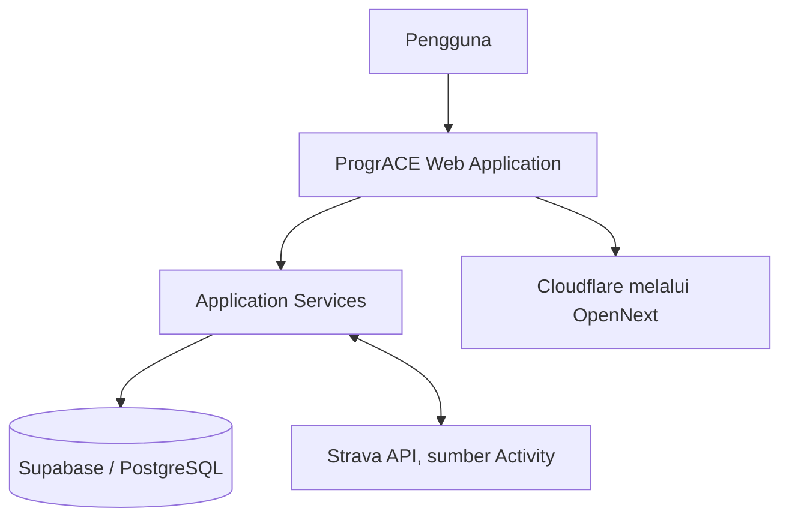
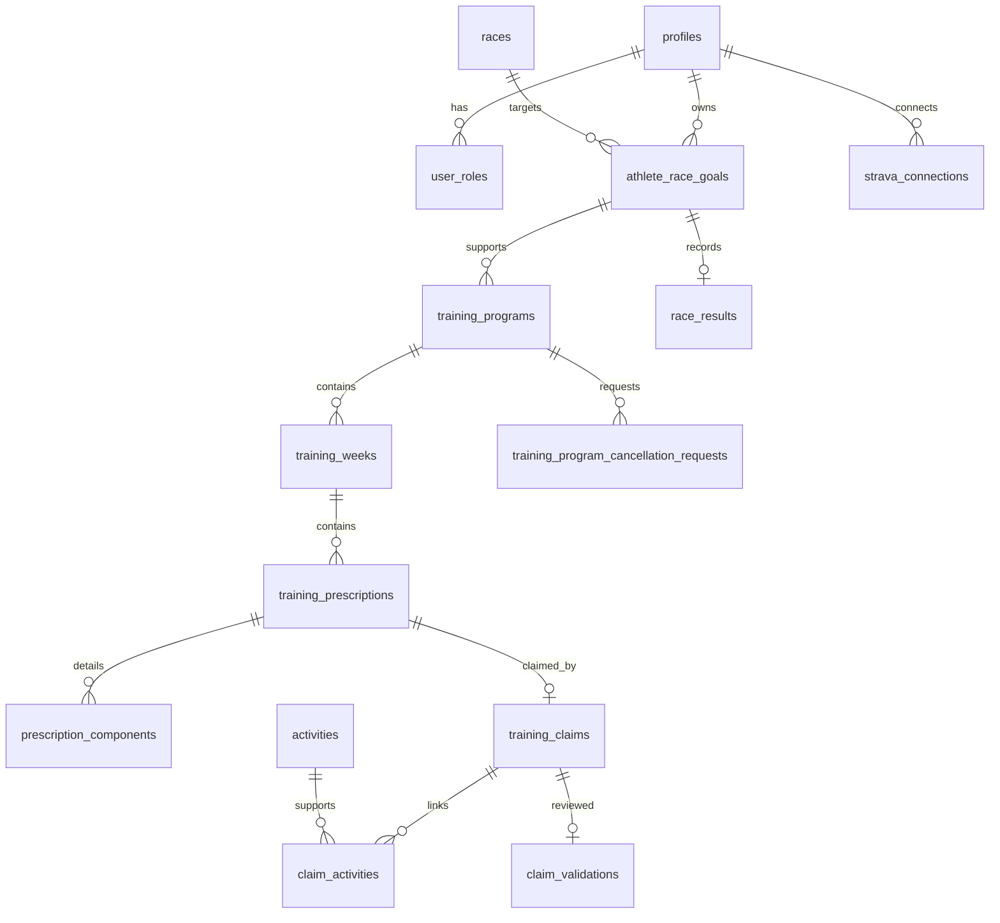

# BUKU PANDUAN PENGGUNAAN PROGRACE

## ProgrACE Versi 1.0 — Baseline Dokumentasi Hak Cipta

**Status dokumen:** Naskah sumber manual pengguna (untuk peninjauan pemilik)

| Informasi | Nilai |
|---|---|
| Nama aplikasi | ProgrACE |
| Versi dokumentasi | 1.0 |
| Baseline perangkat lunak | `v1.0.0-copyright` |
| Pemegang hak cipta | Jay Idoan Sihotang |
| Institusi | Fakultas Teknologi Informasi, Universitas Advent Indonesia |
| Tahun | 2026 |
| Situs resmi | https://progr-ace.idoans.app |

Informasi registrasi, nomor pencatatan, tempat/tanggal publikasi pertama, dan
metadata hukum lain yang belum tersedia harus dilengkapi oleh pemilik hak cipta.

> **Catatan penggunaan naskah.** Istilah tombol dan label berbahasa Inggris
> dipertahankan sebagaimana tampil di aplikasi. Gambar yang dirujuk masih berupa
> placeholder dan harus diisi dengan tangkapan layar data demonstrasi yang telah
> disanitasi.

## Daftar Isi (struktur)

1. Pendahuluan
2. Mengenal ProgrACE
3. Mengakses ProgrACE
4. Panduan Athlete
5. Panduan Coach
6. Panduan Admin
7. Siklus Training Program
8. Pemecahan Masalah
9. Penutup
10. Lampiran

## Daftar Gambar (akan dibuat pada tahap DOCX)

Daftar gambar final dan nomor halaman akan dibuat setelah seluruh placeholder
diganti dengan tangkapan layar yang telah disanitasi. Nomor gambar di naskah ini
digunakan sebagai acuan editorial.

---

# Kata Pengantar

ProgrACE dikembangkan sebagai aplikasi pengelolaan latihan lari yang membantu
menyatukan tujuan perlombaan, perencanaan latihan, bukti aktivitas, peninjauan
Coach, dan catatan hasil Race Day. Dalam praktiknya, informasi tersebut sering
tersebar pada jadwal, catatan pribadi, dan layanan pihak ketiga. Manual ini
menjelaskan bagaimana ProgrACE menjaga hubungan antar-informasi tersebut dalam
satu alur penggunaan yang dapat dipahami oleh Athlete, Coach, dan Admin.

Naskah ini disusun untuk ProgrACE Versi 1.0, yaitu baseline dokumentasi yang
ditetapkan untuk kebutuhan penggunaan aplikasi dan pendukung dokumentasi hak
cipta. Penjelasan di dalamnya berasal dari implementasi yang telah diaudit;
fungsi yang belum tersedia tidak dipresentasikan sebagai bagian dari produk.

Bagi Athlete, buku ini menjelaskan cara membuat Race Goal, membaca Training
Schedule, mencatat Activity, mengajukan Claim, dan meninjau Training Progress.
Bagi Coach, buku ini menjelaskan penyusunan Training Program, perencanaan
mingguan, publikasi, Validation, pengelolaan Race Goal, serta lifecycle
pembatalan. Admin memperoleh penjelasan mengenai fungsi administrasi yang memang
tersedia.

Semoga buku ini membantu penggunaan ProgrACE secara tertib, terutama dalam
membedakan rencana latihan dari bukti aktual, serta menjaga agar riwayat latihan
tetap dapat dipahami setelah suatu program selesai atau dibatalkan.

**Penyusun**

---

# Bab 1 — Pendahuluan

## 1.1 Latar Belakang

Pengelolaan latihan lari menuju sebuah Race melibatkan lebih dari sekadar daftar
latihan harian. Seorang Athlete memiliki Race objective dan target waktu; Coach
menyusun Training Program dengan Training Week, Training Prescription, dan
Training Component; Athlete kemudian menghasilkan Activity sebagai catatan apa
yang benar-benar dilakukan. Setelah itu, Activity yang relevan perlu dihubungkan
dengan Prescription melalui Claim, ditinjau melalui Validation, dan dibaca dalam
konteks Evaluation serta Training Progress.

Tanpa hubungan yang jelas, jadwal yang belum dikerjakan dapat tercampur dengan
bukti latihan, aktivitas yang tidak berkaitan dapat dianggap sebagai pemenuhan
Prescription, dan hasil Race Day dapat keliru diperlakukan sebagai target. ProgrACE
dibangun untuk menjaga perbedaan tersebut sekaligus menyediakan alur yang dapat
digunakan bersama oleh Athlete dan Coach.

## 1.2 Tentang ProgrACE

ProgrACE adalah aplikasi web pengelolaan latihan yang berpusat pada Race Goal
dan interaksi Athlete–Coach. Aplikasi ini menghubungkan sasaran perlombaan dengan
rencana terstruktur, menyimpan bukti aktivitas, menyediakan proses pengajuan dan
peninjauan, serta mempertahankan riwayat ketika program selesai atau dibatalkan.

Hubungan utamanya adalah:

```text
Race Goal → Training Program → Training Schedule → Activity
          → Claim → Validation → Evaluation / Training Progress → Race Result
```

Setiap bagian memiliki fungsi berbeda. Race Goal menyatakan tujuan, Training
Program menyatakan rencana, Activity menyatakan realisasi, Claim menyatakan
hubungan bukti dengan sesi, Validation menyatakan hasil peninjauan, dan Race
Result menyatakan kejadian aktual pada Race Day.

## 1.3 Tujuan Aplikasi

ProgrACE bertujuan membantu pengguna untuk:

- mengorganisasikan latihan berdasarkan Race yang dituju;
- menyusun rencana latihan terstruktur dalam rentang tanggal yang jelas;
- menghubungkan rencana dengan Activity faktual melalui Claim;
- menyediakan ruang peninjauan Coach terhadap bukti Athlete;
- mempertahankan riwayat program, Claim, Validation, dan hasil Race Day; dan
- menyajikan informasi perkembangan latihan yang deskriptif, tanpa menggantikan
  penilaian Coach atau membuat prediksi performa.

ProgrACE bukan alat diagnosis medis, bukan layanan official race timing, dan
bukan sistem yang secara otomatis menentukan latihan berikutnya.

## 1.4 Tujuan buku

Buku ini menjelaskan penggunaan ProgrACE Versi 1.0 berdasarkan perilaku yang
terverifikasi di repository aplikasi. ProgrACE membantu Athlete dan Coach
menyusun latihan lari, mencatat bukti aktivitas, menghubungkan bukti dengan
latihan, melakukan validasi, dan meninjau perkembangan training.

Manual ini menjelaskan tindakan yang tersedia bagi setiap peran, urutan umum
penggunaan, arti status, dan batasan penting. Penjelasan ditulis dari sudut
pandang pengguna; rincian internal repository hanya diringkas sejauh membantu
memahami perilaku aplikasi.

## 1.5 Sasaran pembaca

- **Athlete**, yang mengikuti Race Goal, melihat jadwal, mencatat Activity,
  membuat Claim, dan meninjau evaluasi serta Training Progress.
- **Coach**, yang mengelola Athlete dalam lingkup Training Program miliknya,
  menyusun dan menerbitkan latihan, memvalidasi Claim, meninjau kemajuan,
  mencatat Race Result, serta mengelola siklus pembatalan.
- **Admin**, yang memiliki fungsi administrasi tambahan sesuai kewenangan aplikasi
  dan dapat membantu pengelolaan akun serta data operasional.

## 1.6 Istilah utama

| Istilah | Pengertian dalam ProgrACE |
|---|---|
| Race | Perlombaan yang tersedia sebagai tujuan latihan. |
| Race Goal | Sasaran Athlete untuk satu Race, termasuk tanggal dan target waktu. |
| Training Program | Rencana latihan yang ditautkan ke Race Goal. |
| Training Week | Rentang tanggal mingguan dalam Training Program. |
| Training Prescription | Sesi latihan yang ditugaskan pada tanggal tertentu. |
| Training Component | Rincian Prescription, misalnya jarak, durasi, repetisi, atau pace. |
| Activity | Bukti kegiatan aktual, manual atau dari Strava. |
| Claim | Pengajuan Athlete yang mengaitkan Activity dengan Prescription. |
| Validation | Penilaian Coach/Admin terhadap Claim yang telah dikirim. |
| Evaluation | Status operasional sesi, misalnya `VERIFIED`, `MISSED`, atau `UPCOMING`. |
| Training Progress | Ringkasan deskriptif perkembangan latihan sepanjang program. |
| Race Result | Hasil aktual Race Day yang terpisah dari target Race Goal. |
| Cancellation Request | Permintaan Athlete untuk membatalkan Training Program. |

## 1.7 Ruang lingkup aplikasi

ProgrACE mencakup pengelolaan akun, Race Goal, Training Program, jadwal mingguan,
Activity, integrasi Strava, Claim, Validation, Evaluation, Training Progress,
Race Result, penyalinan program, dan pembatalan program. Fitur seperti prediksi
waktu lomba, VO2Max, readiness score, rekomendasi otomatis, analisis GPS/lap,
dan integrasi official timing bukan bagian dari baseline Versi 1.0.

> **[PLACEHOLDER GAMBAR 1.1]**
> **Gambar 1.1. Halaman awal ProgrACE dan navigasi utama.**
> Peran: pengguna terautentikasi. Rute: `/dashboard`. Tampilkan identitas
> aplikasi, navigasi sesuai peran, dan data demonstrasi saja.

## 1.8 Prinsip keamanan penggunaan

Gunakan akun sendiri dan jangan membagikan kata sandi. Active Mode pada
antarmuka hanya mengubah konteks tampilan; kewenangan sebenarnya ditentukan oleh
peran akun dan hubungan pengelolaan program. Jangan memasukkan token Strava,
kredensial, atau informasi pribadi ke dalam catatan latihan.

---

# Bab 2 — Mengenal ProgrACE

## 2.1 Konsep dasar ProgrACE

ProgrACE memisahkan tujuh gagasan yang sering tercampur dalam pengelolaan
latihan: **goal**, **plan**, **execution**, **evidence**, **review**, **progress**,
dan **result**. Pemisahan ini membuat pengguna dapat menjawab pertanyaan yang
berbeda dengan data yang tepat: apa tujuan Athlete, apa yang direncanakan, apa
yang benar-benar dilakukan, bukti mana yang diajukan, bagaimana Coach
meninjaunya, bagaimana perjalanan program terlihat, dan apa yang terjadi pada
Race Day.

## 2.2 Race Goal sebagai konteks latihan

Race Goal bukan sekadar formulir tanggal dan target waktu. Ia menyatakan Race
yang hendak diikuti Athlete dan menjadi konteks bagi Training Program. Race Date
menetapkan batas akhir program, sedangkan target finish time—bila diisi—menjadi
acuan faktual untuk perbandingan dengan Race Result. Race Goal memiliki lifecycle
`ACTIVE`, `COMPLETED`, dan `CANCELLED`; perubahan status tersebut tidak mengubah
target historis.

## 2.3 Training Program sebagai rencana

Training Program mengubah Race Goal menjadi rencana latihan terstruktur:

```text
Training Program → Training Week → Training Prescription → Training Component
```

Training Week memberi rentang tanggal. Training Prescription adalah satu sesi
yang dijadwalkan. Training Component menjelaskan bagian-bagian sesi, seperti
jarak, durasi, repetisi, recovery, pace target, dan instruction. Hubungan ini
membantu Coach merencanakan detail tanpa menghilangkan konteks program.

## 2.4 Activity sebagai realisasi latihan

Activity adalah catatan faktual tentang latihan yang benar-benar terjadi. Activity
dapat dimasukkan manual atau berasal dari Strava. Sebuah Activity tidak otomatis
memenuhi Prescription hanya karena tanggal atau jaraknya tampak serupa; Athlete
tetap memilih bukti yang akan diajukan melalui Claim.

## 2.5 Claim dan Validation

Claim merupakan jembatan eksplisit antara rencana dan bukti. Prescription
menjawab “apa yang direncanakan”, Activity menjawab “apa yang tercatat”, dan
Claim menyatakan bahwa Activity tertentu diajukan untuk mendukung Prescription
tersebut. Coach atau Admin kemudian melakukan Validation terhadap Claim yang telah
disubmit. Dengan cara ini, aktivitas yang tidak terkait atau belum diajukan tidak
langsung dianggap sebagai penyelesaian sesi.

## 2.6 Evaluation dan Training Progress

Evaluation membantu menjawab kebutuhan operasional per sesi: sesi mana yang
terverifikasi, perlu ditinjau, belum diklaim, akan datang, atau terlewat sesuai
aturan tanggal dan Claim. Training Progress memiliki sudut pandang lebih panjang:
ia merangkum jarak rencana eksplisit, jarak aktual dari bukti sah, outcome
mingguan, dan trend menu sepanjang satu program. Keduanya adalah informasi
deskriptif, bukan diagnosis kebugaran atau skor keberhasilan.

## 2.7 Race Result

Race Result menyimpan kejadian aktual pada Race Day secara terpisah dari Race
Goal. Statusnya tepat tiga: `FINISHED`, `DNF`, dan `DNS`. Race Goal dapat tetap
`ACTIVE` walaupun sudah memiliki Race Result, dan Race Goal `COMPLETED` dapat
belum memiliki Race Result. Pemisahan ini menjaga target dan kenyataan agar tidak
saling menimpa.

## 2.8 Peran pengguna

Satu akun dapat memiliki lebih dari satu peran. Athlete mengelola data dan bukti
miliknya; Coach mengelola Athlete dalam lingkup Training Program yang menjadi
tanggung jawabnya; Admin menjalankan fungsi administrasi yang disediakan. Peran
Coach tidak otomatis berarti akses ke seluruh Athlete.

> **[PLACEHOLDER GAMBAR 2.1]**
> **Gambar 2.1. Contoh navigasi ProgrACE berdasarkan peran pengguna.**
> Peran: Athlete atau Coach. Rute: `/dashboard`. Gunakan data demonstrasi dan
> jangan tampilkan nama, email, atau ID produksi.

## 2.9 Status dan lifecycle penting

Pada Race Goal, `ACTIVE` berarti sasaran masih berjalan, `COMPLETED` berarti
ditutup oleh Coach berwenang pada atau setelah Race Date, dan `CANCELLED` berarti
dibatalkan. Athlete tidak dapat menutup Race Goal sendiri.

Pada Training Program, `DRAFT` adalah ruang persiapan, `PUBLISHED` adalah rencana
yang tersedia untuk pelaksanaan Athlete, `CANCELLED` adalah keadaan terminal
pembatalan, dan `ARCHIVED` adalah keadaan historis yang terpisah dari cancellation.

Pada Training Week, minggu yang belum mempunyai data perencanaan berarti **Not
planned**. Tindakan `Plan This Week` memulai `Draft`; setelah Coach menerbitkan
minggu, Prescription-nya menjadi dapat ditindaklanjuti Athlete. Draft tidak
menimbulkan konsekuensi missed.

## 2.10 Batas tanggal dan interpretasi jadwal

Program selalu berada di antara tanggal mulai dan Race Date. Perencanaan mingguan
tidak memperpanjang tanggal akhir. Hari tanpa Prescription pada minggu Published
tidak otomatis berarti ada Prescription REST; aplikasi menampilkan tidak ada
sesi sesuai konteks jadwal. Minggu yang belum direncanakan juga tidak boleh
ditafsirkan sebagai Rest Week atau latihan yang gagal.

## 2.11 Alur penggunaan ProgrACE

Alur konseptualnya adalah:

```text
Race Goal → Training Program → Training Schedule → Activity
          → Claim → Validation → Evaluation / Training Progress → Race Result
```

Urutan ini bukan kewajiban bahwa setiap program harus langsung memiliki semua
data. Coach dapat merencanakan minggu secara progresif, Athlete dapat mencatat
Activity setelah latihan, dan Race Result dapat tidak ada meskipun Race Goal
sudah selesai. Yang penting, setiap informasi tetap berada pada peran dan
konteksnya masing-masing.

---

# Bab 3 — Mengakses ProgrACE

## 3.1 Membuka aplikasi

Buka situs resmi ProgrACE melalui peramban modern. Halaman publik yang tersedia
meliputi beranda, login, dan registrasi. Setelah berhasil masuk, pengguna melihat
dashboard dan menu yang sesuai dengan perannya. Halaman kalender dan program
publik yang bersifat placeholder lama tidak diperlakukan sebagai Training Schedule
aktif.

**Langkah awal:**

1. Buka situs resmi melalui peramban.
2. Pilih `Login` untuk akun yang sudah terdaftar atau `Registration` untuk akun
   baru.
3. Setelah masuk, gunakan navigasi utama untuk menuju Race Goals, Training,
   Coaching, Profile, atau Admin sesuai akses.

> **[PLACEHOLDER GAMBAR 3.1]**
> **Gambar 3.1. Halaman Login.**
> Peran: belum terautentikasi. Rute: `/login`. Tampilkan hanya formulir login
> tanpa email atau kredensial nyata.

## 3.2 Registrasi dan login

Pada halaman registrasi, isi data yang diminta lalu selesaikan proses autentikasi
yang tersedia. Setelah login berhasil, aplikasi mengarahkan pengguna ke area
dashboard sesuai sesi dan perannya. Jika sesi berakhir, login kembali melalui
halaman Login.

> **[PLACEHOLDER GAMBAR 3.2]**
> **Gambar 3.2. Halaman Registration.**
> Peran: belum terautentikasi. Rute: `/register`. Gunakan data demonstrasi dan
> jangan menampilkan email pribadi.

## 3.3 Profil dan keamanan akun

Menu Profile menyediakan area akun, termasuk perubahan kata sandi untuk pengguna
terautentikasi. Perubahan kata sandi adalah tindakan akun pribadi, bukan proses
pemulihan melalui Race Goal atau Strava. Masukkan kata sandi baru dan konfirmasi
yang sama; aplikasi memberikan umpan balik jika validasi gagal atau berhasil.

**Langkah penggunaan:**

1. Buka Profile/Account.
2. Masukkan New Password dan Confirm New Password.
3. Periksa pesan validasi lalu pilih tindakan perubahan kata sandi.
4. Gunakan kata sandi baru pada login berikutnya.

Kata sandi tidak boleh dimasukkan ke URL, catatan Activity, atau kolom teks lain.

> **[PLACEHOLDER GAMBAR 3.3]**
> **Gambar 3.3. Perubahan kata sandi di Profile.**
> Peran: pengguna terautentikasi. Rute: area Profile/Account. Jangan tampilkan
> nilai kata sandi atau data akun nyata.

## 3.4 Bantuan saat akses gagal

Jika halaman mengembalikan akses tidak tersedia, pastikan sesi masih aktif dan
akun memiliki peran yang sesuai. Jangan mencoba mengganti Active Mode sebagai
cara memperoleh izin; hal itu bukan mekanisme otorisasi.

---

# Bab 4 — Panduan Athlete

## 4.1 Dashboard Athlete

Dashboard merangkum konteks Race Goal dan Training Program yang dapat diakses
Athlete. Gunakan tautan menuju Race Goals, Training Programs, Activities, Claims,
Evaluation, dan Training Progress sesuai kebutuhan.

> **[PLACEHOLDER GAMBAR 4.1]**
> **Gambar 4.1. Dashboard Athlete.**
> Tampilkan Race Goal aktif, program yang tersedia, dan navigasi tanpa data pribadi nyata.

## 4.2 Membuat Race Goal

Race Goal membantu Athlete menyatakan perlombaan yang menjadi arah latihan.
Tanggal Race menentukan kapan tujuan tersebut berlangsung, sedangkan target
finish time—jika tersedia—menyimpan sasaran yang dapat dibandingkan kemudian
dengan Race Result. Race Goal inilah yang nantinya dipilih sebagai konteks
Training Program.

**Langkah penggunaan:**

1. Buka area Race Goals dan pilih Race yang akan diikuti.
2. Masukkan Race Date dan target finish time bila ingin menggunakannya.
3. Periksa kembali data yang ditampilkan, lalu simpan Race Goal.
4. Gunakan Race Goal `ACTIVE` tersebut sebagai konteks Training Program.

Race Goal baru dimulai sebagai `ACTIVE`. Melewati Race Date tidak otomatis
mengubahnya menjadi `COMPLETED`; penutupan dilakukan oleh Coach berwenang.

> **[PLACEHOLDER GAMBAR 4.2]**
> **Gambar 4.2. Form Race Goal.**
> Tampilkan pemilihan Race, tanggal Race, dan target secara demonstratif.

## 4.3 Melihat Race Goal

Halaman Race Goal menampilkan Race, tanggal, target, serta status `ACTIVE`,
`COMPLETED`, atau `CANCELLED`. Race Goal yang telah melewati tanggal Race tetap
`ACTIVE` sampai ditutup oleh Coach berwenang; sistem tidak menutupnya otomatis.

## 4.4 Training Program Athlete

Bagi Athlete, Training Program adalah rencana yang siap diikuti, bukan sekadar
daftar judul latihan. Program menghubungkan Race Goal dengan rentang tanggal,
Training Week, dan Prescription yang diterbitkan Coach. Program `DRAFT` yang
belum diterbitkan dapat masih berubah sehingga tidak diperlakukan sebagai jadwal
aktif.

**Langkah penggunaan:**

1. Buka daftar Training Programs.
2. Pilih program yang berkaitan dengan Race Goal yang ingin diikuti.
3. Periksa status, tanggal mulai/akhir, dan minggu yang tersedia.
4. Buka Training Schedule untuk membaca Prescription yang sudah Published.

> **[PLACEHOLDER GAMBAR 4.3]**
> **Gambar 4.3. Ringkasan Training Program untuk Athlete.**
> Tampilkan konteks Race Goal, status program, dan rentang tanggal.

## 4.5 Training Schedule

Training Schedule menampilkan minggu saat ini terlebih dahulu agar Athlete dapat
memusatkan perhatian pada latihan yang sedang berjalan. `Load Previous Weeks`
dan `Load Next Weeks` digunakan untuk meninjau bagian program lain. Minggu
`PUBLISHED` menampilkan Prescription per hari. Minggu yang belum direncanakan
dapat memberi pesan bahwa training minggu tersebut belum diterbitkan; pesan ini
bukan berarti `Rest Week`, dan tidak menciptakan status gagal.

**Cara membaca jadwal:**

1. Mulai dari kartu bertanda current week.
2. Baca tanggal dan Training Menu pada setiap Prescription.
3. Gunakan navigasi minggu untuk meninjau sejarah atau rencana yang sudah
   diterbitkan.
4. Jika minggu bertanda `Not planned`, tunggu publikasi Coach dan jangan
   menganggap ketiadaan sesi sebagai bukti latihan atau kegagalan.

> **[PLACEHOLDER GAMBAR 4.4]**
> **Gambar 4.4. Training Schedule Athlete dengan penanda current week.**
> Tampilkan heading rentang tanggal, penanda minggu saat ini, dan sesi yang telah diterbitkan.

## 4.6 Membaca Training Prescription

Buka kartu sesi untuk membaca Training Menu, judul, deskripsi, dan komponen
terurut. Komponen dapat memuat jarak, durasi, repetisi, recovery, pace target,
dan instruction sesuai isi Prescription. `INTERVAL` dapat muncul sebagai Workout
Type di dalam sesi `SPEED`; itu bukan Training Menu terpisah.

> **[PLACEHOLDER GAMBAR 4.5]**
> **Gambar 4.5. Detail Training Prescription dan Components.**
> Gunakan sesi demonstrasi; jangan tampilkan catatan pribadi Athlete.

## 4.7 Mencatat Activity manual

Activity adalah catatan apa yang benar-benar dilakukan Athlete. Karena itu,
isilah nilai faktual yang diketahui, bukan nilai yang diharapkan dari
Prescription. Activity dapat berdiri sendiri sampai Athlete memilihnya sebagai
bukti Claim.

**Langkah penggunaan:**

1. Buka Activities dan pilih tindakan untuk menambahkan Activity manual.
2. Masukkan sport type, tanggal, jarak, durasi, serta heart rate, RPE, atau
   catatan bila data tersebut tersedia.
3. Biarkan kolom yang tidak diketahui kosong; jangan mengganti data hilang dengan
   angka nol.
4. Simpan Activity dan gunakan pada Claim bila memang mendukung Prescription.

> **[PLACEHOLDER GAMBAR 4.6]**
> **Gambar 4.6. Pencatatan Activity manual sebagai bukti latihan faktual.**
> Tampilkan nilai demonstrasi, bukan data kesehatan atau identitas nyata.

## 4.8 Menghubungkan Strava

Pada Profile/Account atau area Strava, ikuti alur koneksi yang disediakan.
Strava berfungsi sebagai sumber bukti Activity. Informasi koneksi tidak
ditampilkan sebagai bagian dari antarmuka latihan.

> **[PLACEHOLDER GAMBAR 4.7]**
> **Gambar 4.7. Status koneksi Strava.**
> Tampilkan hanya status umum seperti connected/not connected; sanitasi ID Strava.

## 4.9 Sinkronisasi dan Activities

Setelah koneksi tersedia, aktivitas Strava yang diimpor tampil di daftar
Activities sesuai otorisasi. Pastikan sport type dan data faktual benar sebelum
menggunakannya sebagai bukti Claim.

## 4.10 Membuat Claim

Claim menjelaskan hubungan yang sengaja dibuat Athlete antara Prescription dan
Activity. ProgrACE tidak otomatis menyatakan setiap Activity sebagai penyelesaian
sesi, karena satu Activity dapat terjadi di luar jadwal atau mendukung konteks
yang berbeda.

**Langkah penggunaan:**

1. Buka Prescription `PUBLISHED` yang ingin didukung.
2. Pilih satu atau beberapa Activity yang benar-benar berkaitan.
3. Tinjau tanggal, sport type, jarak, dan durasi bukti.
4. Simpan Claim sebagai `DRAFT` jika masih perlu diperiksa.

> **[PLACEHOLDER GAMBAR 4.8]**
> **Gambar 4.8. Menghubungkan Activity dengan Training Prescription melalui Claim.**
> Tampilkan Prescription, Activity demonstrasi, dan pemilihan bukti.

## 4.11 Mengirim Claim

Tinjau hubungan Prescription–Activity kemudian pilih tindakan submit. Claim yang
telah `SUBMITTED` tidak lagi diperlakukan sebagai draft yang dapat diubah bebas.
Satu Prescription menggunakan paling banyak satu Claim sesuai aturan domain.

## 4.12 Membaca Validation dan Evaluation

Validation adalah hasil peninjauan Coach atau Admin terhadap Claim yang telah
disubmit. Evaluation memberi konteks sesi di dalam jadwal: apakah akan datang,
belum diklaim, perlu ditinjau, terverifikasi, atau terlewat sesuai aturan waktu.
Athlete dapat melihat `VERIFIED`, `PARTIAL`, `NEEDS_REVIEW`, atau `REJECTED`,
sedangkan Evaluation dapat menampilkan `MISSED`, `NOT_CLAIMED`, dan `UPCOMING`.

Status tersebut membantu menentukan tindakan berikutnya pada sesi; status itu
bukan fitness score, penilaian medis, maupun pernyataan tentang kualitas tubuh.

> **[PLACEHOLDER GAMBAR 4.9]**
> **Gambar 4.9. Hasil Validation dan status Evaluation pada Training Program.**
> Tampilkan status sesi dan penjelasan singkat tanpa membuat persentase baru.

## 4.13 Melihat Training Progress

Training Progress membantu Athlete melihat perjalanan latihan dari awal program
hingga minggu berjalan. Halaman ini menyatukan konteks Race dan program, informasi
mingguan, jarak yang direncanakan secara eksplisit, jarak aktual yang berasal dari
bukti running yang sah, outcome sesi, dan trend berdasarkan Training Menu.

Gunakan filter `All Running`, `Easy`, `Medium`, `Long`, atau `Speed` untuk membaca
jenis sesi tertentu bila data tersedia. Untuk sesi dengan beberapa Activity,
jarak dan durasi sesi dijumlahkan, sedangkan heart rate dan RPE tidak dirata-rata
secara sembarangan. Pace ditampilkan bila jarak dan durasi valid; data yang tidak
tersedia tetap ditampilkan sebagai tanda kosong. Jarak tidak diperkirakan dari
durasi saja.

Informasi ini berguna untuk membandingkan rencana dengan catatan aktual secara
deskriptif. Training Progress tidak menghitung VO2Max, readiness, fitness score,
prediksi Race, zona heart rate, atau rekomendasi latihan otomatis.

**Langkah penggunaan:**

1. Buka Training Progress dari Training Program atau konteks Athlete yang sesuai.
2. Periksa program, Race Date, dan current week.
3. Bandingkan Planned dan Completed running distance per minggu.
4. Pilih Training Menu untuk membaca trend sesi tertentu.
5. Gunakan Session Outcomes sebagai informasi faktual, bukan sebagai skor.

> **[PLACEHOLDER GAMBAR 4.10]**
> **Gambar 4.10. Ringkasan Training Progress dan filter Running Trend.**
> Tampilkan Planned/Completed, outcome, dan filter menu dengan data demonstrasi.

## 4.14 Mencatat Race Result

Race Result adalah catatan faktual tentang apa yang terjadi pada Race Day, bukan
pengganti Race Goal. Result hanya dapat dibuat pada atau setelah Race Date untuk
Race Goal milik Athlete.

**Langkah penggunaan:**

1. Buka Race Goal yang Race Date-nya telah tiba.
2. Pilih status `FINISHED`, `DNF`, atau `DNS`.
3. Untuk `FINISHED`, masukkan finish time positif; untuk `DNF` dan `DNS`,
   biarkan finish time kosong.
4. Tambahkan notes bila diperlukan dan simpan.

Race Result tidak mengubah status Race Goal dan tidak menandai target sebagai
berhasil atau gagal. Jika target finish time tersedia, perbandingan ditampilkan
sebagai selisih waktu faktual.

> **[PLACEHOLDER GAMBAR 4.11]**
> **Gambar 4.11. Pencatatan Race Result dengan status FINISHED, DNF, atau DNS.**
> Tampilkan pilihan FINISHED/DNF/DNS dan nilai demonstrasi setelah Race Date.

## 4.15 Meminta pembatalan Training Program

Pembatalan menggunakan permintaan agar Athlete dapat menyampaikan alasan tanpa
langsung menghilangkan program dari konteks Coach. Untuk program `PUBLISHED`,
Athlete memilih `Request Cancellation`, mengisi alasan, dan mengirimkannya.

Alurnya adalah `Request Cancellation` → `PENDING` → keputusan Coach/Admin.
Selama `PENDING`, program tetap tersedia. Jika disetujui, program menjadi
`CANCELLED` dan riwayat latihan tetap dapat ditinjau; jika ditolak, program
tetap berjalan sesuai keputusan yang tercatat.

**Langkah penggunaan:**

1. Buka Training Program `PUBLISHED`.
2. Pilih `Request Cancellation`.
3. Jelaskan alasan secara singkat dan faktual.
4. Kirim permintaan, lalu pantau statusnya pada program.

> **[PLACEHOLDER GAMBAR 4.12]**
> **Gambar 4.12. Pengajuan Request Cancellation dan status PENDING.**
> Gunakan alasan demonstrasi; jangan tampilkan identitas Athlete nyata.

## 4.16 Perbedaan pembatalan dan penghapusan draft

Program `DRAFT` yang belum diterbitkan dapat dihapus melalui operasi yang
disediakan bagi pemiliknya. Penghapusan draft berbeda dari pembatalan program
`PUBLISHED`; keduanya tidak boleh disamakan dengan `ARCHIVED`.

---

# Bab 5 — Panduan Coach

## 5.1 Dashboard dan daftar Athlete

Coach menggunakan area Coaching untuk mengelola proses latihan Athlete yang
berada di bawah Training Program miliknya. Daftar Athlete di sini bukan direktori
umum; setiap kartu seharusnya memiliki konteks Race Goal dan program yang dapat
ditindaklanjuti Coach. Dari konteks tersebut Coach dapat berpindah ke jadwal,
Evaluation, Training Progress, atau Race Result.

**Langkah penggunaan:**

1. Buka menu Coaching dan pilih `Athletes`.
2. Pilih Athlete yang programnya ingin ditinjau.
3. Periksa Race Goal, Race Date, dan Training Program sebelum mengambil tindakan.

> **[PLACEHOLDER GAMBAR 5.1]**
> **Gambar 5.1. Dashboard Coach dan daftar Athlete dalam konteks program.**
> Tampilkan Athlete demonstrasi dan program yang berada dalam scope Coach.

## 5.2 Detail Athlete

Halaman detail adalah ruang kerja Coach untuk satu Athlete, bukan halaman profil
sosial. Halaman ini memperlihatkan Race Goal, Race Date, Training Program yang
relevan, konteks minggu, Evaluation, dan Training Progress. Program historis tetap
dapat ditinjau bila Coach berwenang, termasuk setelah Race Goal `COMPLETED`, agar
keputusan Race Day tidak menghapus sejarah latihan.

> **[PLACEHOLDER GAMBAR 5.2]**
> **Gambar 5.2. Detail Athlete dengan konteks Race Goal dan Training Program.**
> Tampilkan ringkasan progress dan tautan ke program terkait.

## 5.3 Membuat Training Program secara manual

Training Program memberi struktur pada pekerjaan Coach: rentang tanggal, minggu,
sesi, dan komponen dapat disiapkan sebelum Athlete melihatnya. Program harus
terhubung ke Race Goal `ACTIVE` yang tepat dan tidak boleh melewati Race Date.

**Langkah penggunaan:**

1. Dari area Training Programs, pilih Athlete dan Race Goal yang eligible.
2. Masukkan nama program serta tanggal mulai dan akhir yang sah.
3. Pastikan tanggal akhir tidak melampaui Race Date.
4. Simpan sebagai `DRAFT` untuk melanjutkan penyusunan.

> **[PLACEHOLDER GAMBAR 5.3]**
> **Gambar 5.3. Pembuatan Training Program dari Race Goal aktif.**
> Tampilkan hanya Race Goal aktif dan data demonstrasi.

## 5.4 Mengimpor jadwal XLSX

Import XLSX merupakan pilihan ketika Coach telah memiliki rencana lengkap. Pilihan
ini melengkapi, bukan menggantikan, perencanaan mingguan. Template membantu Coach
menuliskan Prescription dan Component dalam struktur yang dikenali aplikasi.

**Langkah penggunaan:**

1. Pilih `Download XLSX Template` dan gunakan kolom yang tersedia.
2. Isi tanggal, Training Menu, judul/deskripsi, serta komponen latihan.
3. Pilih `Import Training Plan` dan tunggu preview.
4. Periksa pesan validasi, tanggal, urutan, dan isi sesi.
5. Konfirmasi hanya setelah preview sesuai program yang dipilih.

Program hasil impor yang diterbitkan tetap menggunakan alur penuh-program yang
sama seperti sebelumnya; Coach tidak perlu menerbitkan setiap minggu impor secara
manual.

> **[PLACEHOLDER GAMBAR 5.4]**
> **Gambar 5.4. Template XLSX dan preview validasi sebelum impor.**
> Gunakan berkas demonstrasi tanpa nama file atau data Athlete nyata.

## 5.5 Menyusun Training Week

Pada Training Schedule, minggu tanpa perencanaan ditampilkan sebagai `Not
planned`. Ini membedakan minggu yang belum disiapkan dari minggu Published yang
kebetulan memiliki hari tanpa sesi. Menekan `Plan This Week` memulai persiapan
minggu tersebut dan mengubahnya menjadi `Draft`; melihat atau menavigasi minggu
saja tidak memulai perencanaan.

Program dan Race Date tetap menjadi batas keras. Perencanaan progresif tidak
memperpanjang program dan tidak membuat sesi di luar tanggal yang sah.

**Langkah penggunaan:**

1. Buka Training Schedule dan pilih minggu bertanda `Not planned`.
2. Pastikan rentang tanggal minggu berada dalam program.
3. Pilih `Plan This Week` ketika Coach benar-benar siap menyusun isinya.
4. Lanjutkan dengan menambahkan Training Session.

> **[PLACEHOLDER GAMBAR 5.5]**
> **Gambar 5.5. Memulai perencanaan pada minggu yang berstatus Not planned.**
> Tampilkan rentang tanggal yang sah dan penanda minggu saat ini.

## 5.6 Menambahkan Training Session

Training Prescription adalah satu sesi lengkap, sedangkan Training Component
adalah bagian terstruktur di dalam sesi tersebut. Pemisahan ini memungkinkan
Coach menggambarkan sesi sederhana maupun sesi bertahap tanpa membuat model sesi
baru.

Di minggu `DRAFT`, pilih `+ Add Training Session`, lalu isi Date, Training Menu,
Title, dan Description. Tambahkan satu atau beberapa Component; Date harus berada
di dalam minggu dan program.

**Langkah penggunaan:**

1. Buka minggu `Draft` yang sedang disiapkan.
2. Pilih `+ Add Training Session`.
3. Isi informasi umum sesi.
4. Tambahkan Components dan periksa urutannya.
5. Simpan sesi, lalu ulangi bila minggu memiliki beberapa sesi.

## 5.7 Mengelola Components

Component mengikuti struktur yang sama dengan impor: urutan, Workout Type,
target distance, target duration, repetitions, distance per repetition, recovery,
target pace, dan instruction bila relevan. `SPEED` dapat memiliki Workout Type
`INTERVAL`; `INTERVAL` bukan Training Menu baru. Gunakan unit yang ditampilkan
form dan hindari menebak nilai yang tidak diketahui.

> **[PLACEHOLDER GAMBAR 5.6]**
> **Gambar 5.6. Form Training Session dan editor Training Component.**
> Tampilkan form mobile-friendly dengan minimal satu komponen demonstrasi.

## 5.8 Mengedit dan menghapus sesi draft

Coach dapat mengedit Prescription dan Components selama minggu masih `DRAFT`.
Hal ini memberi ruang untuk memperbaiki tanggal, uraian, atau rincian komponen
sebelum Athlete melihat sesi. `Delete Training Session` meminta konfirmasi dan
menghapus rincian sesi. Menghapus sesi terakhir tidak menghapus minggu; minggu
tetap `DRAFT` sehingga Coach dapat melanjutkan persiapan.

> **[PLACEHOLDER GAMBAR 5.7]**
> **Gambar 5.7. Pengeditan sesi Draft dan konfirmasi penghapusan.**
> Jangan gunakan browser alert pada tangkapan layar final.

## 5.9 Menerbitkan Training Week

`Publish Week` menandai bahwa Coach telah menyelesaikan rencana minggu. Minggu
`DRAFT` harus memiliki setidaknya satu Prescription; minggu kosong tidak dapat
diterbitkan agar tidak membingungkan antara “belum selesai disiapkan” dan “sengaja
beristirahat”. Setelah Published, Athlete dapat melihat dan mengklaim sesi,
sedangkan editor mingguan tidak lagi mengubah isinya.

**Langkah penggunaan:**

1. Periksa semua tanggal, sesi, dan Components.
2. Pastikan minggu memiliki sedikitnya satu Prescription.
3. Pilih `Publish Week`.
4. Pastikan label berubah menjadi `Published` sebelum melanjutkan ke minggu lain.

> **[PLACEHOLDER GAMBAR 5.8]**
> **Gambar 5.8. Penerbitan Training Week setelah rencana selesai disiapkan.**
> Tampilkan minggu berisi sesi dan status Published setelah berhasil.

## 5.10 Menerbitkan Training Program

Untuk program `DRAFT`, Coach dapat menggunakan `Publish program` setelah data
program dan jadwal memenuhi validasi. Publication program berbeda dari publication
setiap minggu: program aktif masih dapat memiliki minggu yang belum direncanakan.
Dengan demikian, Coach dapat membuka rencana untuk Athlete tanpa berpura-pura
bahwa seluruh bagian masa depan telah selesai ditulis.

## 5.11 Memvalidasi Claim

Buka Claim yang telah `SUBMITTED`, tinjau Prescription dan Activity pendukung,
lalu tetapkan hasil Validation. `PARTIAL` dan `REJECTED` memerlukan catatan
sesuai aturan. Hasil ini menjadi input Evaluation dan tidak boleh diubah dengan
menyalin data ke sistem penilaian lain.

> **[PLACEHOLDER GAMBAR 5.9]**
> **Gambar 5.9. Peninjauan Claim dan penetapan Validation oleh Coach.**
> Tampilkan status, bukti Activity, dan catatan demonstrasi.

## 5.12 Meninjau Evaluation

Evaluation membantu menjawab sesi mana yang perlu perhatian sekarang. Coach dapat
menggunakannya untuk memprioritaskan peninjauan Claim, bukan untuk menyimpulkan
tingkat kebugaran Athlete. Status `MISSED` hanya muncul sesuai batas tracking,
tanggal berjalan, status minggu, dan aturan Claim yang berlaku; `DRAFT` serta
minggu belum direncanakan tidak menjadi konsekuensi negatif.

## 5.13 Meninjau Training Progress Athlete

Evaluation menjawab perhatian pada sesi; Training Progress membantu Coach melihat
perjalanan program secara lebih luas. Gunakan `Training Progress` dari Athlete
detail untuk membaca Planned versus Completed running distance, outcome mingguan,
current week, dan trend menu. Periksa apakah data aktual berasal dari Claim yang
sah dan ingat bahwa minggu berjalan belum selesai. Halaman ini deskriptif, bukan
ranking, readiness score, atau prediksi Race.

> **[PLACEHOLDER GAMBAR 5.10]**
> **Gambar 5.10. Training Progress Athlete dalam konteks Coach.**
> Tampilkan konteks Athlete + Program yang memang dimiliki Coach.

## 5.14 Mengelola Race Result

Race Result dan Race Goal Completion adalah dua tindakan berbeda. Race Result
mencatat apa yang terjadi pada Race Day; completion menutup lifecycle Race Goal.
Pada atau setelah Race Date, Coach berwenang dapat mencatat atau mengoreksi Race
Result Athlete dalam program yang menjadi tanggung jawabnya. `recorded_by`
menyimpan pencatat awal dan tidak berubah ketika editor melakukan koreksi.
`FINISHED` menyimpan waktu positif; `DNF` dan `DNS` tidak memiliki finish time.

**Langkah penggunaan:**

1. Buka Athlete detail dan pilih Race Goal yang Race Date-nya telah tiba.
2. Pilih tindakan Race Result.
3. Masukkan status, finish time bila `FINISHED`, dan notes bila diperlukan.
4. Simpan atau koreksi data yang sudah ada tanpa mengubah pencatat awal.

## 5.15 Menandai Race Goal sebagai COMPLETED

Coach dapat memilih `Mark as Completed` hanya jika Race Date telah tiba atau
terlewati dan Coach memiliki kewenangan pada program terkait. Sebelum mengonfirmasi,
pastikan penutupan memang sesuai keputusan lifecycle, bukan sekadar karena
Evaluation menampilkan banyak sesi selesai. Completion tidak berarti 100%
kepatuhan, target waktu tercapai, atau seluruh Claim `VERIFIED`.

Setelah konfirmasi, Race Goal menjadi `COMPLETED`. Training Program, Activity,
Claim, Validation, dan Training Progress tetap tersedia untuk riwayat. Race
Result boleh sudah ada atau belum ada.

## 5.16 Menyalin Training Program

Coach dapat menyalin program sumber yang berada dalam scope-nya ke Athlete/Race
Goal tujuan yang eligible pada Race yang sama. Operasi membuat program tujuan
`DRAFT` dan menyalin struktur minggu, Prescription, serta Components. Claim,
Activity, Validation, audit pembatalan, dan batas tracking tidak ikut disalin.

## 5.17 Meninjau Cancellation Request

Athlete dapat mengajukan pembatalan program `PUBLISHED` dengan alasan. Coach
pemilik membuka permintaan `PENDING`, meninjau alasan, lalu memilih approve atau
decline. Approve membuat program `CANCELLED` dan mempertahankan sejarah.

## 5.18 Pembatalan langsung oleh Coach

Coach pemilik dapat membatalkan program aktif sesuai operasi yang tersedia,
terutama bila tidak ada permintaan pending yang harus ditinjau. Pembatalan
memiliki tanggal efektif dan menjadi keadaan terminal; program tidak kembali ke
`PUBLISHED` melalui alur ini.

> **[PLACEHOLDER GAMBAR 5.11]**
> **Gambar 5.11. Pembatalan langsung Training Program oleh Coach.**
> Tampilkan dialog alasan dan peringatan bahwa data historis dipertahankan.

## 5.19 Menghapus Draft Program

Program `DRAFT` dapat dihapus oleh Coach yang berwenang melalui operasi
`Delete Draft Program`. Tindakan ini berbeda dari membatalkan program Published
dan bersifat destruktif terhadap draft yang belum menjadi riwayat aktif.

> **[PLACEHOLDER GAMBAR 5.12]**
> **Gambar 5.12. Penghapusan Training Program Draft.**
> Tampilkan konfirmasi dan program demonstrasi yang belum diterbitkan.

## 5.20 Program berstatus CANCELLED atau ARCHIVED

Program `CANCELLED` tetap dapat ditinjau untuk riwayat, namun tidak menerima
perencanaan aktif baru. `ARCHIVED` adalah keadaan berbeda dan tidak boleh disebut
sebagai sinonim pembatalan. Jika perilaku tampilan tertentu tidak tersedia pada
build yang digunakan, tandai untuk verifikasi manual.

## 5.21 Batas kewenangan Coach

Coach tidak dapat memperoleh akses hanya dengan mengubah Active Mode. Setiap
tindakan penting memerlukan sesi, peran aktual, dan hubungan Coach dengan
Training Program yang relevan.

---

# Bab 6 — Panduan Admin

## 6.1 Akses Admin

Admin menggunakan navigasi Admin sesuai peran aktual. Admin memiliki akses lebih
luas daripada Athlete atau Coach pada fungsi administrasi yang memang tersedia,
namun tetap tidak memperoleh fitur yang tidak diimplementasikan.

## 6.2 Manage Users

Halaman `/dashboard/admin/users` menyediakan direktori pengguna dengan pencarian,
ringkasan Accounts, Athletes, Coaches, dan Athlete yang terhubung ke Strava.
Badge role tetap menunjukkan `ATHLETE` atau `COACH`; warna oranye pada Athlete
hanya menandakan koneksi Strava saat ini, bukan izin, Claim, atau hasil sinkronisasi.

> **[PLACEHOLDER GAMBAR 6.1]**
> **Gambar 6.1. Admin Manage Users dan ringkasan akun.**
> Gunakan data sintetis; jangan tampilkan nama, email, atau identifier produksi.

## 6.3 User Detail dan Strava Access

Admin dapat membuka User Detail untuk melihat Account, Roles, Password Status,
dan Strava Access sesuai kewenangan. Informasi koneksi provider ditampilkan hanya
sebagai status yang diperlukan untuk pengelolaan akun.

> **[PLACEHOLDER GAMBAR 6.2]**
> **Gambar 6.2. Admin User Detail.**
> Tampilkan status umum Roles/Password/Strava tanpa nilai rahasia.

## 6.4 Admin Reset Password

Admin dapat membantu pemulihan akses melalui `Reset Password`. Aplikasi
menghasilkan kata sandi sementara untuk satu kali tampilan dan menandai akun
sebagai wajib mengganti kata sandi. Kata sandi sementara tidak disimpan sebagai
teks biasa pada data aplikasi, tidak dikirim melalui URL, dan tidak ditampilkan
kembali pada halaman baca.

## 6.5 Batas fungsi Admin

Baseline ini tidak menyediakan pembuatan/penghapusan pengguna, mutasi role,
impersonation, atau `Login as User`. Jangan menganggap tampilan Manage Users
sebagai izin untuk melakukan fungsi tersebut.

---

# Bab 7 — Siklus Training Program

## 7.1 Dari Race Goal ke program

Athlete atau Coach yang berwenang memilih Race Goal `ACTIVE`, lalu membuat
Training Program dengan batas tanggal yang tidak melewati Race Date. Program
dimulai sebagai `DRAFT` bila masih disiapkan. Race Goal `COMPLETED` atau
`CANCELLED` tidak dipakai untuk membuat program baru.

## 7.2 Dari draft ke jadwal mingguan

Coach dapat mengimpor program lengkap melalui XLSX atau merencanakan minggu demi
minggu. Minggu yang belum disiapkan tidak dianggap sebagai Rest Week atau
training yang gagal. Tindakan `Plan This Week` memulai perencanaan; setelah sesi
ditambahkan, `Publish Week` membuat Prescription tersedia bagi Athlete.

> **[PLACEHOLDER GAMBAR 7.1]**
> **Gambar 7.1. Siklus Training Program dari Draft ke Published.**
> Tampilkan status program dan status minggu secara bersamaan dengan data demonstrasi.

## 7.3 Dari Prescription ke Activity

Athlete membaca Prescription yang diterbitkan lalu melakukan latihan. Bukti dapat
berasal dari Activity manual atau sinkronisasi Strava. Activity sendiri belum
menjadi bukti program sampai dikaitkan melalui Claim.

## 7.4 Dari Claim ke Validation

Athlete memilih Activity yang mendukung Prescription dan mengirim Claim. Coach
atau Admin meninjau Claim `SUBMITTED` dan menghasilkan Validation. Claim draft,
Activity yang tidak diklaim, dan minggu draft tidak ikut menjadi bukti evaluasi
program.

## 7.5 Dari Evaluation ke Training Progress

Evaluation memberi konteks operasional per sesi. Training Progress merangkum
perjalanan program secara longitudinal: jarak rencana eksplisit, jarak aktual
running dari Claim yang sah, outcome mingguan, dan trend menu. Keduanya tidak
menghasilkan skor kebugaran atau prediksi Race.

## 7.6 Race Day dan Race Result

Pada atau setelah Race Date, Race Result dapat dicatat sebagai `FINISHED`, `DNF`,
atau `DNS`. Result disimpan terpisah dari Race Goal dan tidak otomatis mengubah
status Race Goal. Perbandingan target versus aktual hanya berupa selisih waktu
faktual bila target tersedia.

> **[PLACEHOLDER GAMBAR 7.2]**
> **Gambar 7.2. Alur historis sampai Race Result.**
> Gunakan contoh sintetis tanpa data pribadi dan tanpa menyiratkan hubungan kausal.

## 7.7 Race Goal selesai

Setelah Race Date, Coach pemilik atau Admin dapat menutup Race Goal dengan
`Mark as Completed`. Penyelesaian adalah keputusan lifecycle, bukan bukti bahwa
seluruh sesi selesai atau target waktu tercapai. Training history, Claims,
Validations, dan Training Progress tetap dapat ditinjau.

## 7.8 Cancellation Request Athlete

Untuk program Published, Athlete memasukkan alasan melalui `Request Cancellation`.
Status program tetap Published selama menunggu keputusan. Coach pemilik atau
Admin dapat approve atau decline.

## 7.9 Cancellation langsung Coach/Admin

Coach pemilik atau Admin dapat membatalkan program aktif melalui operasi yang
diizinkan. Approval maupun pembatalan langsung menghasilkan `CANCELLED`, menjaga
data historis, dan menggunakan tanggal efektif pembatalan sebagai batas atas
evaluasi yang relevan.

## 7.10 Draft deletion

Draft yang belum diterbitkan dapat dihapus secara terpisah. Penghapusan draft
bukan cancellation, dan bukan pula archival. Gunakan tindakan ini hanya ketika
draft memang tidak lagi diperlukan.

## 7.11 Program historis

Program Completed/CANCELLED tetap menjadi konteks historis. Race Goal yang
Completed dapat tetap memiliki Training Program tanpa Race Result; data tersebut
valid dan tidak boleh diisi secara tebakan dari Strava.

## 7.12 Batas evaluasi dan mid-program adoption

Tidak semua program dimulai tepat pada hari pertama rentang tanggalnya. Jika
Athlete mulai mengikuti program di tengah periode, `tracking_start_date` menjadi
awal efektif untuk membaca training yang diharapkan. Prescription sebelum titik
tersebut tidak otomatis menjadi `MISSED` hanya karena tanggalnya telah lewat.

Untuk program yang dibatalkan, tanggal efektif cancellation menjadi batas atas
eksklusif bagi training yang diharapkan. Batas ini membantu Evaluation membedakan
riwayat sebelum adopsi, periode aktif, dan hari setelah program dihentikan tanpa
mengubah Prescription atau Claim yang sudah tercatat.

---

# Bab 8 — Informasi Teknis dan Pemecahan Masalah

## 8.1 Arsitektur umum ProgrACE

ProgrACE adalah aplikasi web yang digunakan melalui peramban. Pengguna berinteraksi
dengan halaman aplikasi, sedangkan layanan aplikasi mengelola autentikasi,
validasi, dan pembacaan/penyimpanan data pada Supabase. Strava menjadi sumber
Activity eksternal ketika Athlete memilih untuk menghubungkannya. Aplikasi
dijalankan pada lingkungan Cloudflare melalui OpenNext.



Diagram ini adalah gambaran konseptual, bukan instruksi konfigurasi. Pengguna
tidak perlu mengelola layanan tersebut untuk menjalankan kegiatan harian di
ProgrACE.

## 8.2 Technology Stack

| Teknologi | Peran dalam ProgrACE |
|---|---|
| Next.js App Router | Kerangka halaman dan navigasi aplikasi web. |
| React | Penyusunan komponen antarmuka interaktif. |
| TypeScript | Menjaga struktur tipe pada kode aplikasi. |
| Tailwind CSS dan komponen UI | Tampilan responsif dan konsisten. |
| Supabase Auth | Pengelolaan sesi autentikasi. |
| PostgreSQL melalui Supabase | Penyimpanan data relasional ProgrACE. |
| Strava API | Sumber Activity yang dihubungkan oleh Athlete. |
| OpenNext dan Cloudflare Workers | Lingkungan publikasi aplikasi. |

## 8.3 Gambaran database

ProgrACE menggunakan model relasional yang menghubungkan pengguna, Race, Race
Goal, Training Program, Training Week, Training Prescription, Training Component,
Activity, Claim, Validation, dan Race Result. Hubungan ini membantu aplikasi
menjaga konteks setiap catatan. Diagram konseptual dan ringkasan entitas tersedia
di Lampiran B; lampiran tersebut tidak memuat baris data produksi.

## 8.4 Integrasi Strava

Strava digunakan sebagai sumber Activity bagi Athlete yang memilih koneksi.
Setelah koneksi dan sinkronisasi berhasil, Activity dapat dibaca dalam area
Activities dan dipilih sebagai bukti Claim. ProgrACE tetap menjadi pemilik aturan
Training Program, Claim, Validation, dan Evaluation; Strava tidak menentukan
apakah suatu sesi dianggap selesai. Jika Activity tidak diklaim, Activity tersebut
tidak menjadi bukti untuk Training Progress program.

## 8.5 Deployment

Versi publik ProgrACE disajikan melalui lingkungan Cloudflare menggunakan
OpenNext. Situs resmi aplikasi adalah `https://progr-ace.idoans.app`. Detail
operasional, konfigurasi deployment, dan kredensial tidak diperlukan dalam manual
pengguna dan tidak dicantumkan di sini.

## 8.6 Jika impor XLSX gagal

Pastikan berkas berasal dari template yang sesuai, workbook dapat dibuka, dan
tanggal serta nilai komponen berada dalam batas program. Jalankan preview sebelum
konfirmasi. Jika muncul pesan error, catat pesan dan tindakan terakhir tanpa
mengirim kata sandi, token, URL berisi identifier, atau file yang memuat data
Athlete lain.

## 8.7 Jika sesi tidak muncul

Periksa status program dan minggu. Minggu `DRAFT` atau `Not planned` belum menjadi
jadwal actionable Athlete. Untuk menghubungkan Activity, pastikan Prescription
telah `PUBLISHED`, Claim dibuat, dan Claim dikirim sesuai alur.

## 8.8 Jika Strava belum terhubung

Periksa status koneksi pada Profile/Account dan ulangi alur koneksi provider.
Activity yang belum berhasil masuk tidak dapat dipilih sebagai bukti. Jangan
menyalin token atau secret ke formulir atau pesan bantuan.

## 8.9 Jika akses Coach ditolak

Pastikan Coach memiliki Training Program terkait. Peran Coach saja tidak memberi
akses ke semua Athlete, dan Active Mode hanya mengubah tampilan. Jika akses tetap
ditolak, sampaikan rute umum dan pesan UI kepada pengelola tanpa membagikan data
rahasia.

> **[PLACEHOLDER GAMBAR 8.1]**
> **Gambar 8.1. Contoh pesan validasi atau error yang telah disanitasi.**
> Tampilkan pesan produk tanpa URL produksi, UUID, email, atau data pribadi.

## 8.10 Informasi untuk permintaan bantuan

Catat rute umum, waktu kejadian, tindakan terakhir, dan pesan yang terlihat.
Gunakan data demonstrasi bila perlu mengirim screenshot. Jangan kirim kata sandi,
credential, token, UUID produksi, atau screenshot yang memuat identitas Athlete.

---

# Bab 9 — Penutup

ProgrACE Versi 1.0 menyediakan alur terhubung dari sasaran Race sampai peninjauan
hasil latihan dan Race Day. Gunakan status dan batasan yang dijelaskan di buku
ini agar Prescription, Activity, Claim, Validation, Evaluation, Training Progress,
dan Race Result tidak tercampur. Untuk materi publik atau pendaftaran hak cipta,
gunakan data demonstrasi dan tangkapan layar yang telah disanitasi.

---

# Lampiran A — Inventaris fitur terkonfirmasi

| Domain | Fitur utama | Status |
|---|---|---|
| Akun | Registrasi, login, profile, change password | Implemented |
| Race Goal | Create, view, update/cancel own; Coach/Admin completion | Implemented |
| Program | Manual creation, publication, cancellation, draft deletion | Implemented |
| XLSX | Template, preview, validated atomic import | Implemented |
| Weekly planning | Unplanned/Draft/Published week lifecycle | Implemented |
| Activity | Manual dan Strava evidence | Implemented |
| Claim | Draft, submitted, one Claim per Prescription | Implemented |
| Validation | Coach/Admin review dengan outcome | Implemented |
| Evaluation | Session states dan attention context | Implemented |
| Progress | Program-scoped running analytics | Implemented |
| Race Result | FINISHED, DNF, DNS dan derived difference | Implemented |
| Copy | Copy struktur program menjadi Draft | Implemented |
| Cancellation | Athlete request, Coach review, direct cancel | Implemented |
| Admin | User directory, Strava status, reset password | Implemented |

Fitur prediksi performa, fitness/readiness score, AI recommendation, official
timing, lap/stream analysis, dan Race Result charts tidak termasuk baseline ini.

# Lampiran B — Entitas database konseptual

Entitas berikut teridentifikasi dari schema dan migration aktif. Nama tabel
ditulis untuk keperluan teknis; pengguna tidak perlu mengaksesnya langsung.



Ringkasan: `profiles`, `user_roles`, `races`, dan `athlete_race_goals` mengelola
identitas serta sasaran; `training_programs`, `training_weeks`,
`training_prescriptions`, dan `prescription_components` menyimpan rencana;
`activities`, `training_claims`, `claim_activities`, `claim_validations`, dan
`validation_checks` menyimpan bukti dan penilaian; `race_results` menyimpan hasil
Race Day; tabel Strava mengelola koneksi/evidence; tabel cancellation menyimpan
permintaan dan audit lifecycle. Evaluation dan Training Progress diturunkan dari
data tersebut, bukan tabel score terpisah.

> **[PLACEHOLDER GAMBAR B.1]**
> **Gambar B.1. Diagram konseptual entitas database.**
> Gunakan diagram yang dirender dari data konseptual; jangan tampilkan row nyata.

# Lampiran C — Versi dan bukti repository

| Item | Nilai |
|---|---|
| Produk | ProgrACE |
| Baseline copyright | `v1.0.0-copyright` |
| Baseline aplikasi | `7b08de311f043b51551ec71e54ffba1028a54dc2` |
| Baseline dokumentasi | `5121c6afc013a668b985c02eca38d8ab49d8468f` |
| Tahun dokumentasi | 2026 |

## Repository Evidence

- `AGENTS.md`
- `app/` untuk route dan Server Components
- `src/features/` untuk domain Race Goal, Training Program, Claim, Evaluation,
  Running Analytics, Race Result, Copy, dan Cancellation
- `supabase/migrations/` untuk schema, constraints, RLS, serta RPC
- `supabase/tests/` dan `src/features/**/__tests__` untuk perilaku teruji
- `docs/copyright/00-baseline-audit.md` sampai `13-demo-data-specification.md`
  untuk audit, inventaris, dan rencana screenshot
- `package.json`, `next.config.*`, `open-next.config.*`, dan `wrangler.jsonc`
  untuk stack serta deployment

Dokumen ini adalah naskah sumber. Sebelum diubah menjadi DOCX/PDF, pemilik perlu
meninjau legal metadata, label UI pada build yang disetujui, dan seluruh gambar
demonstrasi.
